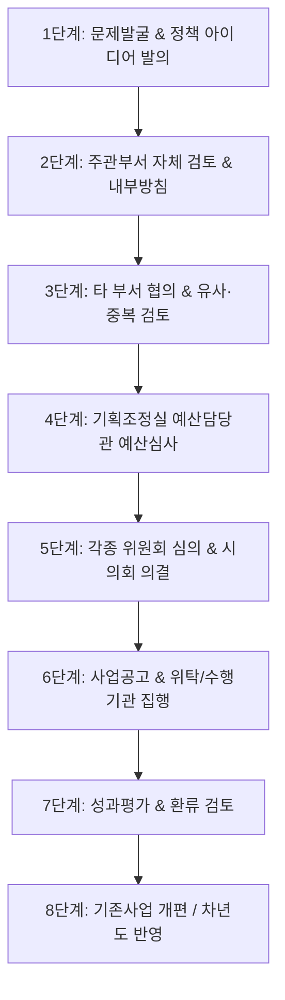

# A3. 인천광역시 정책·행정 워크플로우 맵 (6대 전략산업 확장)

> 본 문서는 인천광역시의 6대 첨단 전략산업(바이오, 반도체, 미래모빌리티, 로봇·항공, 물류·항만, 스마트시티·AI) 및 청년·교육(RISE) 정책이 실제 아이디어발의부터 의회 의결, 집행, 성과평가까지 도달하는 8단계 워크플로우를 정리한 문서입니다.
> **[공식 절차]**와 **[추정한 실무 관행]**을 엄격히 분리하여 기록하였습니다.

---

## 1. 단계별 행정 워크플로우 명세

### 1단계: 문제발굴 & 정책 아이디어 발의
- **구분**: [공식 절차]
- **입력문서**: 기업/대학/현장 수요조사서, 국정/시정 과제 추진 지침, 정부 공모 안내문
- **작성자**: 실무 주무관 / 인천테크노파크(ITP) 전담PD / 대학 RISE 센터
- **검토자**: 담당 팀장
- **결정자**: 담당 과장 (예: 반도체바이오과장, 미래모빌리티과장, 청년정책담당관 등)
- **반려/실패 사유**: 근거법령 부재, 시정 방향 불일치, 명확한 수혜 대상 미설정

### 2단계: 주관부서 자체 검토 & 내부방침 수립
- **구분**: [공식 절차] & [추정한 실무 관행]
- **입력문서**: 사업기획서(안), 내부 방침서(시장/부시장/국장 결재)
- **작성자**: 담당 주무관
- **검토자**: 팀장 및 과장
- **결정자**: 담당 국장 (미래산업국장 등) 또는 정무/행정부시장
- **반려/실패 사유**: 재정 부담 과다, 추진 필요성 소명 부족, 유사한 기존사업 존재

### 3단계: 타 부서 협의 & 유사·중복 검토
- **구분**: [공식 절차] (법령 및 예산 지침 필수 항목)
- **입력문서**: 부서 협의 요청서, 유사·중복 사업 자체 검토서
- **작성자**: 주관 부서 주무관
- **검토자**: 청년정책담당관(청년사업 시), 교육협력담당관(대학/RISE 연계 시), 평가담당관
- **결정자**: 관련 부서장 합의
- **반려/실패 사유**: 타 부서 기존 사업과 대상·수단·직무 동일(중복 판정), 예산 중복 반영 방침
- **실무 관행 [추론]**: 공식 문서 제출 전 주무관 간 전화·메신저를 통한 '사전 핑퐁'으로 중복 조율

### 4단계: 기획조정실 예산담당관 예산 심사
- **구분**: [공식 절차] (매년 6월~9월 본예산 심사)
- **입력문서**: 사업별 예산요구서, 예산설명서, 성과계획서
- **작성자**: 주관 부서 주무관
- **검토자**: 예산담당관 예산 1·2팀 심사관
- **결정자**: 예산담당관 -> 기획조정실장 -> 시장
- **반려/실패 사유**: 세수 부족에 따른 사업 우선순위 밀림, 산출근거 미흡, 국비/시비 매칭 비율 불합리

### 5단계: 위원회 심의 & 시의회 의결
- **구분**: [공식 절차] (매년 11월~12월 시의회 정례회)
- **입력문서**: 인천광역시 세입세출 예산안, 위원회 안건 제출서
- **작성자**: 기획조정실 예산담당관 및 상임위원회 전문위원
- **검토자**: 청년정책조정위원회 / RISE 위원회 -> 시의회 상임위(산업경제위원회 등)
- **결정자**: 인천광역시의회 본회의 (의결)
- **반려/실패 사유**: 시의회 예산 삭감(수정 의결), 조례 미비, 위원회 부적절 판정

### 6단계: 사업 공고 & 수행기관 집행
- **구분**: [공식 절차]
- **입력문서**: 사업 추진 확정 공고문, 위수탁 협약서, 지원사업 모집 공고문
- **작성자**: 주관 부서 및 수행기관(인천테크노파크 등)
- **검토자**: 수행기관 센터장/팀장
- **결정자**: 인천테크노파크 원장 / 대학 총장 / 인천광역시장
- **반려/실패 사유**: 미달 공고(모집 미달), 기업/청년 참여율 저조로 인한 변경 공고

### 7단계: 성과평가 & 환류 검토
- **구분**: [공식 절차]
- **입력문서**: 최종 실적보고서, 출입처/외부 평가위원 성과평가서, 시정평가서
- **작성자**: 수행기관 및 주관부서 주무관
- **검토자**: 평가담당관 / 외부 평가위원회
- **결정자**: 기획조정실장
- **반려/실패 사유**: 목표 KPI 미달성(취업률, 기업 만족도 저하), 집행률 미진(예산 이월/불용)

### 8단계: 기존사업 개편 / 차년도 반영
- **구분**: [공식 절차] & [추정한 실무 관행]
- **입력문서**: 차년도 사업 개편안, 사업 통폐합 검토서
- **작성자**: 주관 부서 주무관
- **결정자**: 담당 국장 및 예산담당관
- **결과**: 사업 유지, 예산 증액/감액, 기존 사업과 통합, 사업 일몰(종료)

---

## 2. 의사결정자 및 유저 타겟팅

| 구분 | 작성 유저 (Writer) | 검토 유저 (Reviewer) | 결정 유저 (Decision Maker) |
|---|---|---|---|
| **시청 주관부서** | 미래산업국/청년정책 주무관 | 반도체바이오과장, 청년정책담당관 | 미래산업국장, 기획조정실장 |
| **수행기관** | 인천테크노파크(ITP) 전담PD | ITP 센터장, 책임연구원 | 인천테크노파크 원장 |
| **시의회** | 상임위 전문위원 | 예결위 심사위원 | 산업경제위원장, 의장 |

---

## 3. 관련 근거 공식 링크

- 인천광역시 조직도 및 사무분장: [incheon.go.kr](https://www.incheon.go.kr)
- 인천광역시의회 세입세출 심사: [incheon.go.kr/council](https://www.incheon.go.kr/council)
- 인천테크노파크 지원사업 공고: [itp.or.kr](https://www.itp.or.kr)
- 비즈OK 기업지원 포털: [bizok.incheon.go.kr](https://bizok.incheon.go.kr)
