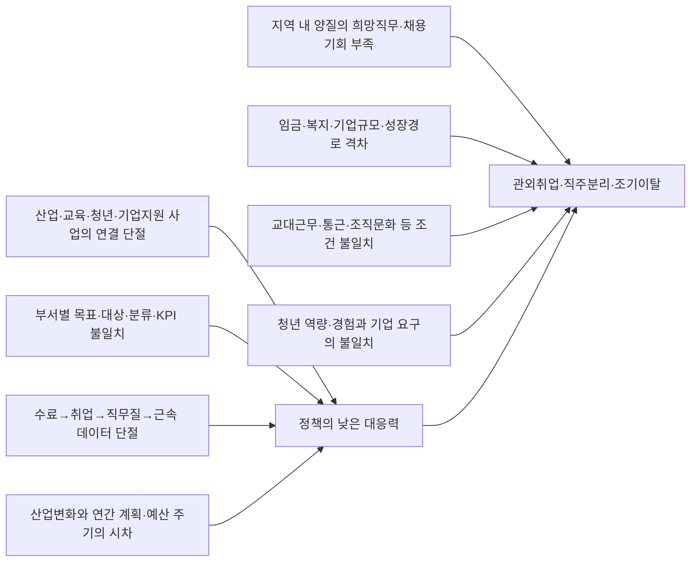
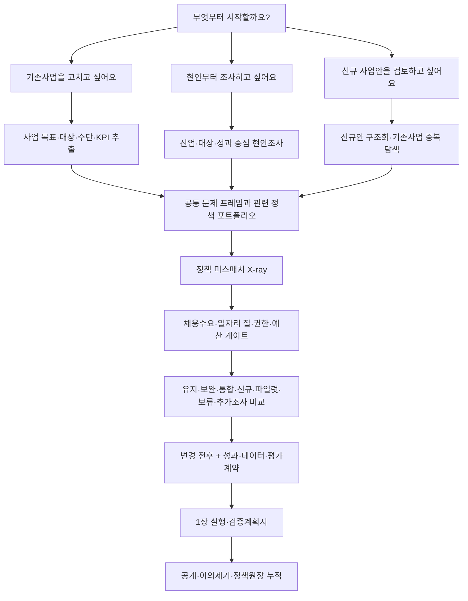

# 정책핏 인천: 지역산업 수요–정책 포트폴리오 정합성 설계 워크벤치 최종 제안

기준일: **2026-08-13**  
인터뷰 범위: 15개 질문 완료  
상위 제품비전: **인천 전략산업 수요와 정책 포트폴리오의 공백·중복·시차·대상·지역·예산 불일치 진단**  
첫 검증 모듈: **바이오의약품 청년 취업정책**  
첫 모듈 대상: **인천 거주자 또는 인천 소재 학교 출신의 바이오·생명·화학·화공계열 전문학사·학사 졸업예정자 및 졸업 3년 이내 청년**  
첫 모듈 직무: **생산·공정·QA/QC 첫 취업**  
초기 작성 사용자: **인천광역시 반도체바이오과 등 정책 발의부서**  
공동 검토 사용자: **청년정책담당관, 교육협력·RISE·일자리·기업지원·예산 담당자와 수행기관**

> **정책을 찾는 서비스가 아니라, 지역산업·기업·인재 수요와 현재 정책 포트폴리오를 비교해 기존 사업을 고칠지, 연결·통합할지, 정말 새 사업이 필요한지를 근거와 함께 판단하는 서비스다.** 현업 부서는 `기존사업 수정 / 현안조사 / 신규안 검토` 중 어디서든 시작해 **유지·보완·연결·통합·신규·파일럿·보류·추가조사**를 동일한 근거로 비교한다.

## 한눈에 보는 최종 결론

- 상위 문제는 `청년유출 단일문제`가 아니라 **지역산업의 관측된 기업·인력·기술 수요와 정책 포트폴리오의 대상·기능·시기·지역·예산·성과설계 불일치**다.
- 이 불일치는 정책 실효성·예산 효율·기업 경쟁력·인재와 일자리·산업 생태계·지역격차·정책 신뢰에 영향을 줄 수 있다. 다만 일곱 결과를 플랫폼의 직접 성과로 주장하지 않는다.
- 공개데이터가 늘어나므로 `설계 정합성`, `예산–수요 배분`, `산업·고용 배경추세`는 더 잘 측정할 수 있다. 반대로 여러 정책과 경기요인이 섞여 매출·고용·투자의 **정책 인과효과는 더 어려워진다.**
- 플랫폼의 직접 성과는 근거 있는 진단과 정책결정의 품질·속도·추적가능성이다. 기업 성장·청년 취업·지역정착은 채택된 정책의 중장기 기여성과로 분리한다.
- 제품구조는 범용 포트폴리오 워크벤치로 만들되, 3일 검증은 **인천 바이오 청년 취업 모듈 하나**로 좁힌다.

### 최종 솔루션 한 장 요약

| 항목 | 최종안 |
|---|---|
| 서비스명 | **정책핏 인천** |
| 배정 주제 | **I3 — 청년–지역기업 정보 비대칭·부서별 정책 분산** |
| 직접 사용자 | 전략산업·기업지원·일자리 사업을 발의·개편하는 현업 부서 실무자 |
| 파일럿 사용자 | 반도체바이오과, 공동 검토자는 청년정책담당관·교육·일자리·예산 담당자 |
| 첫 검증 모듈 | 인천 바이오 관련 전공 졸업예정자·졸업 3년 이내 청년의 생산·공정·QA/QC 첫 취업 |
| 장기 확장 | 기업 성장·기술/R&D·산업 생태계·지역격차 모듈 |
| 세 가지 입구 | 기존사업 수정 / 현안부터 조사 / 신규 사업안 검토 |
| 공통 AI 흐름 | 문서·현안 입력 → 근거검색·구조화 → 미스매치 후보 → 실행조건부 처방 → 사람 승인 |
| 핵심 메커니즘 | 지역수요–정책 포트폴리오 행렬 + 정책사슬 X-ray + 수요·추가성·권한·예산·측정가능성 게이트 |
| 최종 산출물 | 원문 근거, 변경 전후, 담당·예산·기한, KPI와 검증방법을 담은 **1장 실행·검증계획서** |
| 3일 검증 | 실제 공식자료 3개 사업의 추출·근거연결·오류·미스매치·처방 재현성 |
| 검증하지 못하는 것 | 실제 취업·근속·청년이탈 감소, 기관 도입, 기업 확정수요 |

### AI가 하는 일과 하지 않는 일

> `공식 정책·성과 문서와 사용자의 사업안`을 근거검색이 결합된 LLM이 `문제·대상·수단·KPI·직무·근거`로 구조화하고 미스매치와 처방 후보를 만든다. 규칙엔진이 채용수요·일자리 질·권한·예산·데이터 관문을 검사하고, 현업 담당자는 원문을 확인해 최종 정책안을 선택한다. 근거가 없으면 AI는 답을 만들어내지 않고 `미확인·추가조사`를 반환한다.

비AI 기준선은 담당자가 여러 PDF·HWP·통계·공고를 수작업으로 찾아 표와 검토서를 만드는 현행 방식이다. 3일 프로토타입에서는 동일한 3개 사업에 대해 수작업 정답지와 AI 결과를 비교해, AI가 구조화·근거탐색·후보생성에서 시간을 줄이면서 오류를 늘리지 않는지를 검증한다. 계산·관문판정·최종결정은 LLM에 맡기지 않는다.

---

## 1. 최종 문제 정의

### 1.1 해결하려는 사회문제

> 인천은 청년을 거주인구로는 순유입시키고 있지만, 졸업예정자와 초기경력 청년이 원하는 임금·직무·성장경로를 갖춘 지역 일자리가 충분하지 않아 관외취업과 직주분리가 나타나며, 지역 취업 이후에도 양질의 조건과 장기근속이 보장되지 않는다.

### 1.2 서비스가 직접 해결할 의사결정 문제

> 인천의 현업 부서는 바이오 취업 관련 교육훈련·인턴·매칭·기업지원·근속지원 사업의 목표·대상·수단·성과지표가 산업수요와 상위 청년정책 목표에 맞는지, 기존 사업을 유지·보완·통합하거나 신규 사업을 만들어야 하는지를 동일한 근거와 기준으로 판단하기 어렵다.

### 1.3 최종 한 문장 문제 정의

> **인천시 취업정책 담당자는 바이오 생산·공정·QA/QC 진입을 준비하는 졸업예정자·졸업 3년 이내 청년을 대상으로 한 여러 사업의 목표–대상–수단–성과경로가 실제 지역 산업수요와 양질의 취업·근속 목표에 맞는지 판단할 공통 근거체계가 없어, 기존 사업의 유지·보완·통합과 신규 정책 필요성을 증거 기반으로 결정하기 어렵다.**

### 1.4 용어 구분

| 용어 | 이 제안에서의 의미 |
|---|---|
| 주민등록 전출 | 인천에서 다른 시·도로 주소를 옮김 |
| 관외취업 | 인천 거주 청년의 주 사업장이 인천 밖에 있음 |
| 직무 이탈 | 바이오 생산·공정·QA/QC 경로에서 다른 직무로 이동 |
| 조기이탈 | 인천 양질 바이오직무 입사 후 3·6·12개월 내 부정적 퇴사 |
| 상향 이동 | 더 높은 임금·직무·성장기회의 일자리로 이동한 경우로, 실패와 분리 |

최근 인천 청년의 주소 기준 순이동은 플러스이므로 이 다섯 현상을 `청년 유출률` 하나로 합치지 않는다.

### 1.5 바이오를 우선 산업으로 선택한 근거

- **[사실]** 한국은행 인천본부 자료에서 2024년 인천 바이오산업 종사자는 8,740명으로 2020년 대비 51.8% 증가했고, 생산액은 약 7.7조 원이었다.
- **[사실]** 공개된 2022년 산업구조 자료에서는 생산직 비중이 51%로, 전문학사·학사 청년의 생산·공정·품질 진입경로를 검토할 근거가 있다.
- **[사실]** K-NIBRT, 인천대 제조·품질관리 과정, RISE·대학과 청년도약기지 등 비교 가능한 교육·취업사업이 이미 존재한다.
- **[판단]** 산업성장, 지역특화성, 기존 정책밀도와 3일 공개자료 분석 가능성을 함께 고려해 바이오의약품 생산·공정·QA/QC를 첫 사례로 선택했다.
- **[한계]** 인천 바이오는 소수 대기업 집중도가 높고 전체 청년 선호직무를 대표하지 않는다. 바이오 사례의 결과를 인천 전체 청년이나 타 산업에 그대로 일반화하지 않는다.

---

## 2. 문제의 원인 구조



### 2.1 확인된 사실

- 인천의 18~39세 청년 순이동은 최근 플러스이며, 단순 주민등록 순유출 도시는 아니다.
- 인천 제2차 청년정책 기본계획 자료에서 취업·일시휴직 청년의 32.8%가 관외에서 근무하는 것으로 제시됐다.
- 관외취업 사유의 단일 1위는 `인천에 원하는 직무·적성 일자리가 없어서` 33.6%였고, 타지역의 더 높은 임금·복지도 21.9%였다.
- 인천에는 청년정책조정위원회, RISE, K-NIBRT, 인천대 훈련과정, 청년도약기지 등 연결 장치와 사업이 이미 존재한다.
- 공개성과는 참여·수료·전체 취업자에서 끝나는 경우가 많고, 인천 사업장·실제 직무·임금·고용형태·6/12개월 근속이 함께 공개되지 않는다.

### 2.2 강한 반대가설

- 정책 연계 부족보다 임금·복지·대기업 및 전문직의 절대량 부족이 더 큰 원인일 수 있다.
- 기업이 원하는 생산현장 인력과 청년이 원하는 일자리 사이의 선호 충돌이 핵심일 수 있다.
- 수도권 통합 노동시장에서 관외취업 자체는 실패가 아닐 수 있으며, 더 좋은 타지역 취업은 합리적 상향 이동일 수 있다.
- 대기업이 자체 채용·훈련을 충분히 수행한다면 새로운 정책분석 플랫폼의 추가가치가 작을 수 있다.

### 2.3 정책 연계 부족과 청년이탈의 관계

정책 연계 부족은 관외취업의 입증된 주원인이 아니라 **조정 가능한 중간원인 후보**다. 정책설계를 개선해도 양질 일자리 총량과 조건이 바뀌지 않으면 청년의 선택은 달라지지 않는다. 서비스의 인과경로는 다음처럼 길고 조건부다.

`근거 있는 진단 → 사업 보완·통합·신규 결정 → 실제 사업설계 변경 → 양질 기업·직무 연결 → 인천 취업·근속 증가 → 부정적 관외취업·이탈 감소`

앞 단계의 성공이 뒤 단계의 성공을 보장하지 않는다.

### 2.4 현재 정책 수립 흐름과 잠정 병목

공개된 조직·계획을 조합하면 바이오 취업정책은 대체로 다음 권한선을 지난다.

```text
현업 사업부서의 문제·수요 발굴
→ 청년정책담당관의 청년성과·시행계획 교차검토
→ 교육협력·경제정책·수행기관의 실행 가능성 확인
→ 청년정책조정위원회 및 예산 절차
→ 수행기관 집행
→ 연간 실적평가와 다음 계획 환류
```

- **[사실]** 반도체바이오과는 바이오산업 육성·지원과 관련 사업을 담당하고, 청년정책담당관은 청년 기본·시행계획을 총괄한다.
- **[사실]** [청년정책조정위원회](https://youth.incheon.go.kr/participation/committee.jsp)는 기본·시행계획, 연도별 추진실적과 관련 사업의 조정·협력을 심의한다. 즉 공식 연계장치가 아예 없는 것은 아니다.
- **[추론]** 공개자료만으로 내부 초안 작성자·결재선·부서협의의 실제 작동방식은 확정할 수 없다. 회의 횟수나 원안가결만으로 조정이 형식적이라고 단정하지 않는다.
- **[잠정 병목]** 서로 다른 지휘·예산·성과책임, 사업별 대상·분류·KPI 불일치, 월별 수요와 연간 계획의 시차, 수행기관 성과자료의 비표준, 취업·근속 결과의 단절이다.
- **[서비스 개입점]** 연말 평가가 아니라 현업 부서가 제안서를 만들기 직전에 공통 근거와 성과경로를 확인한다.

---

## 3. 현재 아이디어에 대한 냉정한 평가

현재 근거 기준 총점은 **34/55점, 평균 3.1/5점**이다. 정책검색과 다른 문제를 겨냥하고 3일 기술실증은 가능하지만, 청년이탈 감소와의 인과 연결과 핵심 성과데이터가 약하다.

| 평가항목 | 점수 | 근거와 감점 이유 |
|---|---:|---|
| 문제의 중요성 | 4/5 | 관외취업과 원하는 직무·임금 격차는 중요하다. 다만 주민등록 `청년 유출`로 표현하면 최근 순유입 사실과 충돌한다. |
| 인천 지역 특화성 | 4/5 | 바이오 종사자 8,740명, 송도 생산·CDMO 기반과 K-NIBRT·대학·청년사업이라는 구체적 맥락이 있다. 방법론 자체는 타 지자체에도 적용 가능하다. |
| 문제와 해결책의 인과적 연결성 | 2/5 | 잘못 설계된 사업을 개선할 가능성은 있지만 플랫폼이 임금·기업규모·채용총량을 직접 바꾸지 않는다. |
| 목표 사용자의 명확성 | 4/5 | 발의부서 실무자, 청년정책담당관 허브, 관계부서·위원회 검토자로 구분했다. 실제 결재선과 소유권은 현장 확인이 남았다. |
| 데이터 확보 가능성 | 2/5 | 정책·공고·공개성과는 확보 가능하나 사업장·직무·임금·6/12개월 근속 코호트가 공개되지 않는다. |
| 분석 결과의 신뢰성 | 3/5 | 원문 연결, 규칙계산, 사람승인과 세 축 분리를 설계했다. 판정자 일치도와 LLM 안정성은 미검증이다. |
| 행정 현장의 활용 가능성 | 3/5 | 1장 검토서를 후속 자료에 재사용하는 유인이 있다. 담당자 테스트와 기존 결재시스템 중복 여부는 미확인이다. |
| 기존 서비스 대비 차별성 | 4/5 | 개인 정책검색이 아니라 정책의 유지·보완·통합·신규 결정을 지원한다. 단순 문서요약으로 구현하면 차별성이 사라진다. |
| 기술적 구현 가능성 | 4/5 | 3개 사업의 근거행렬·플래그·조건부 처방·1장 검토서는 3일 내 얇은 프로토타입이 가능하다. 운영제품은 훨씬 어렵다. |
| 정책 실행으로 이어질 가능성 | 2/5 | 실행조건을 붙일 수 있으나 예산·법·중앙부처·대학·기업 권한 때문에 채택되지 않을 수 있다. |
| 청년인재 유출 감소 잠재영향 | 2/5 | 일부 교육·매칭을 개선할 수 있지만 효과는 간접적이며 양질 일자리 공급이 그대로면 영향이 작다. |

### 3.1 강점

- `더 잘 찾는 정책포털`이 아니라 `더 잘 설계하는 정책도구`라는 차별점이 분명하다.
- 실제 현업의 계속·개편·통합·신규 결정에 맞춰 산출물을 설계했다.
- 사실·추론·추천, 공개자료·미공개, 낮은 성과·미측정을 구분한다.
- LLM 단독판단이 아니라 원문 근거·규칙·사람승인 구조를 갖는다.
- 한 번 확인한 사전검토서 데이터를 대시보드와 공식 보고서에 재사용한다.

### 3.2 약점과 사각지대

- 청년이탈의 핵심 원인이 정책 정합성 부족이라는 증거가 없다.
- 실제 기업의 미래 수요와 청년 선호를 공개 채용공고만으로 대표하기 어렵다.
- 정책 간 유사문구가 실제 기능중복을 뜻하지 않을 수 있다.
- 좋은 정책안도 시가 통제할 수 없는 중앙부처 사업·대학 자율권·기업 채용결정에 막힐 수 있다.
- 공개평가가 정책개선보다 기관낙인·예산삭감·데이터 은폐를 유발할 수 있다.

### 3.3 행정효율과 청년성과의 구분

| 도달 단계 | 무엇이 달라지는가 | 현재 검증 여부 |
|---|---|---|
| 분석도구 | 문서 구조화·근거 추적·미스매치 후보 생성 | 3일 검증 가능 |
| 행정효율 | 보고시간·재작업·근거 누락 감소 | 미검증 |
| 의사결정 | 실제 계속·개편·통합 판단 변화 | 미검증 |
| 사업실행 | 대상·교육·기업선정·KPI 변경 | 미검증 |
| 청년성과 | 인천 양질 취업·6/12개월 근속 증가 | 미검증 |
| 지역성과 | 부정적 관외취업·지역이탈 감소 | 미검증 |

행정시간만 줄면 행정지원 도구다. 실제 사업이 바뀌면 의사결정 지원 도구다. 비교 가능한 청년성과가 개선돼야 청년이탈 문제 해결에 기여했다고 말할 수 있다.

---

## 4. 반드시 보완해야 할 핵심 문제

1. **문제명 정정:** 주민등록 청년유출이 아니라 관외취업·직주분리·양질 경력경로의 문제로 표현한다.
2. **직접원인과 조정가능 원인 분리:** 임금·채용총량·기업규모 문제와 정책설계·매칭 문제를 나눠 각기 다른 처방을 제시한다.
3. **성과자료 공백 공개:** 지역·직무·임금·계약·근속이 없으면 성과가 나쁘다가 아니라 `미측정`으로 표시한다.
4. **중복탐지 통제:** 텍스트 유사도가 아니라 대상, 기능, 교육강도, 전달단계, 인계관계와 채용시기로 비교한다.
5. **실행성 관문:** 모든 추천에 권한부서, 협력기관, 예산·법적 근거, 데이터, 시행시기와 기각조건을 붙인다.
6. **청년 관점의 일자리 질:** 기업 미충원 감소를 성공으로 보지 않고 임금·계약·직무·4대보험·근속 기준을 적용한다.
7. **공개평가 거버넌스:** 초안·확인·이의제기·검토완료 상태, 반론권, 버전과 정정이력을 공개한다.
8. **인과 주장 제한:** 3일 결과를 취업률·청년이탈 감소 효과로 홍보하지 않는다.
9. **장기 성과추적 로드맵:** 다음 기수부터 공통 사업ID와 수료–면접–오퍼–취업–직무질–근속 필드를 심는다.
10. **현장 채택 검증:** 3일 이후에는 청년정책담당관·반도체바이오과·수행기관이 실제 검토서를 사용할지 별도 검증한다.

---

## 5. 서비스 콘셉트 3안

### 안 1. 정책 정합성 진단 서비스

기존 또는 신규 사업안을 넣으면 정책의 `문제–대상–수단–KPI–상위성과` 연결을 검사하고, 사업 간 중복·공백·시차·대상 및 성과 불일치를 원문 근거와 함께 보여준다.

> 사업을 제출하기 전에 목적과 수단, 산업수요와 청년성과가 맞는지 검사하는 정책 X-ray

### 안 2. 정책 시나리오·의사결정 지원 서비스

`현행 유지 / 기존사업 보완 / 역할 재설계·통합 / 신규사업 / 추가조사` 시나리오를 대상, 권한, 비용, 데이터와 성과경로 관점에서 비교한다. 취업률을 예측하는 모형이 아니라 **실행조건과 불확실성을 비교하는 정책처방 도구**다.

> 진단 결과에 따라 사업을 어떻게 고쳐 쓸지 선택하게 하는 정책 리디자인 워크벤치

### 안 3. 청년·기업·교육기관·정책 수요 매칭 서비스

기업의 확정 채용직무·역량수요, 청년의 전공·역량·선호조건, 대학·훈련기관의 교육과정을 공통 직무코드로 연결하고 훈련–면접–취업–근속 전환을 추적한다.

> 정책 설계 이후 실제 청년과 일자리의 연결을 수행하는 실행 서비스

---

## 6. 각 서비스안의 사용자·가치·기능·데이터·장점·위험

| 서비스안 | 핵심 사용자 | 제공가치 | 핵심 기능 | 필요 데이터 | 장점 | 주요 위험 |
|---|---|---|---|---|---|---|
| 정책 정합성 진단 | 정책 발의부서 실무자, 청년정책담당관 | 제출 전 잘못된 전제·공백·중복 발견 | 문서 구조화, 논리모형, 미스매치 지도, 3축 평가, 원문 추적 | 정책·사업·예산·성과 문서, 산업·고용·채용·교육 자료 | 3일 구현 가능, 설명·감사 가능 | 진단·문서요약에서 끝나면 정책을 바꾸지 못함 |
| 정책 시나리오·의사결정 지원 | 발의부서, 과장·실국장, 청년정책담당관, 위원회·예산부서 | 유지·보완·통합·신규·보류 대안 비교 | 조건부 처방, 변경 전후 비교, 권한·예산·데이터 관문, 1장 검토서 | 정합성 자료, 예산·법적 근거, 담당기관, 과거 성과 | 무엇을 만들었는지 가장 분명하고 결정에 직접 연결 | 효과를 수치예측하면 거짓 정밀성, 실행권한 무시 위험 |
| 수요 매칭 | 사업운영기관, 기업, 대학·훈련기관, 청년 | 실제 훈련–채용–근속 연결과 수요 환류 | 직무·역량 표준화, 확정수요 확인, 매칭, 전환추적 | 기업 채용계획, 청년 프로필, 교육성과, 개인 고용·근속자료 | 청년성과와 가장 직접 연결 | 개인정보·협약·기업참여·콜드스타트, 기존 취업포털과 유사 |

### 행정기관의 도입 유인

- 현업 부서가 1장 사전검토서에서 한 번 확인한 내용을 분기점검·시행계획·위원회·예산자료에 재사용한다.
- 별도 대시보드 입력을 요구하지 않고 기존 문서에서 초안을 추출해 담당자는 오류·차이만 확인한다.
- 부서 간 논쟁을 추상적 주장 대신 동일한 대상·기간·KPI·원문 근거로 바꾼다.
- 사업을 그대로 유지하더라도 왜 유지했는지, 어떤 근거가 부족했는지를 기록한다.

### 주요 이해관계 충돌

- 반도체바이오과는 산업·기업수요를, 청년정책담당관은 청년성과를, 교육협력·RISE와 대학은 교육운영을 우선할 수 있다.
- 기업의 미충원 해소가 청년에게 양질의 일자리라는 뜻은 아니다.
- 공개된 낮은 정합성이 개선 신호가 아니라 기관 낙인·예산삭감 신호로 사용될 수 있다.
- 성과가 잘 측정되는 단기사업이 장기적 기반사업보다 유리해질 수 있다.

따라서 발의부서는 사업 사실과 실행 책임, 청년정책담당관은 공통 청년성과, 관계기관은 실행 가능성, 최종 결재권자·위원회는 공식 결정 책임을 맡는 역할구분이 필요하다.

---

## 7. 세 가지 서비스안 비교표

5점은 해당 기준에서 가장 유리함을 뜻한다. 이는 사업 서열을 위한 종합점수가 아니라 MVP 선택을 위한 비교다.

| 비교기준 | 정합성 진단 | 시나리오·의사결정 | 수요 매칭 |
|---|---:|---:|---:|
| 3일 시연 가능성 | 5 | 4 | 1 |
| 현재 공개데이터 적합성 | 4 | 3 | 1 |
| 현업 정책발의 단계 적합성 | 5 | 5 | 2 |
| 결과의 현재 신뢰성 | 4 | 3 | 2 |
| 정책 변경과의 직접성 | 3 | 5 | 2 |
| 청년 취업성과와의 직접성 | 2 | 3 | 5 |
| 정책검색 서비스와 차별성 | 5 | 5 | 3 |
| 운영 난도 | 낮음~중간 | 중간 | 매우 높음 |
| 핵심 위험 | 요약보고서화 | 거짓 효과예측 | 데이터·기관협력 실패 |

### 정책검색 서비스와 정책설계 서비스의 명확한 구분

| 정책을 검색하기 쉽게 만드는 서비스 | 더 나은 정책을 설계하도록 돕는 서비스 |
|---|---|
| 청년이 `내가 받을 사업`을 찾는다 | 담당자가 `이 사업을 만들거나 고칠 근거`를 찾는다 |
| 사업명·자격·신청링크 중심 | 문제–대상–수단–KPI–성과경로 중심 |
| 개인추천·조회·신청이 핵심 | 유지·보완·통합·신규 결정이 핵심 |
| 최신 정책목록이 주요 자산 | 버전 있는 근거원장·결정이력이 주요 자산 |
| 클릭·신청이 운영성과 | 정책 변경과 후속 취업·근속이 성과 |

본 서비스는 오른쪽이다. 정책검색은 보조자료 수집 기능일 뿐 핵심 가치가 아니다.

### 현행·유사 서비스와의 동일 기준 비교

`공개 페이지에서 확인하지 못함`은 해당 기관 내부에 기능이 절대 없다는 뜻이 아니다. 다음 비교는 공개된 사용자 기능을 기준으로 한다.

| 비교 대상 | 주 사용자·결정 | 이미 제공하는 가치 | 공개 기능에서 남은 공백 | 정책핏 인천의 차이 |
|---|---|---|---|---|
| 인천청년포털 | 청년의 정책 검색·신청 | 인천·전국 정책목록, 캘린더, 신청정보 | 개별 사업의 문제–수단–KPI와 타 사업 관계를 진단하지 않음 | 정책 수혜자가 아니라 사업 발의자가 제출 전 설계를 검사 |
| 인천일자리플랫폼 | 구직자·기업의 채용·교육·정책 탐색 | 다수 시스템 연계, 맞춤검색, 기업·지원기관 정보등록 | 검색된 사업을 유지·보완·통합할 근거와 실행조건을 비교하지 않음 | 현안–산업수요–청년조건–기존사업의 근거행렬과 처방 생성 |
| 온통청년 | 청년의 정책검색·자격진단·상담 | 전국 정책 통합검색, 조건 비교, 개인추천 | 지자체의 정책 포트폴리오·예산·성과경로 설계가 목적이 아님 | 정책의 대상·수단·성과 단절과 공백·역할중첩 후보를 감사 |
| ISTANS·인천데이터포털 | 통계 탐색·데이터 제공 | 산업통계 표준화 또는 공공데이터 카탈로그 | 통계를 특정 정책안의 권한·예산·KPI 결정으로 바꾸지 않음 | 근거를 실제 유지·개편·통합·신규·보류 결정서로 전환 |
| 현행 수작업 검토 | 현업 담당자의 문서·협의 | 담당자의 맥락판단과 공식 책임 | 여러 PDF·HWP·통계·공고를 반복 탐색하고 근거·버전·결측을 공통 구조로 비교하기 어려움 | AI는 추출·검색·후보생성을 보조하고 규칙과 사람이 계산·승인; 검토 데이터를 재사용 |

새로운 원리는 `더 많은 정보를 한 화면에 모으기`가 아니다. **정책 제안 전에 원문 근거로 정책사슬을 검사하고, 실행조건을 통과하지 못한 추천은 보류하며, 채택안에는 다음 기수의 검증 설계까지 함께 심는 것**이다.

---

## 8. 가장 추천하는 서비스안과 선정 이유

### 최종 추천: 정책 정합성 진단 기반의 사업 맞춤형 정책처방 워크벤치

안 1의 감사 가능한 진단을 기반으로 안 2의 제한적인 처방을 결합한다. 안 3의 개인 매칭은 데이터와 협력체계가 마련된 후의 확장으로 둔다.

> 현업 부서가 기존 취업사업 또는 신규 아이디어를 선택하면, 시스템이 지역 현안·산업수요·청년의 일자리 조건·기존 사업을 원문 근거로 조사하고 미스매치를 찾아 `유지·보완·통합·신규·추가조사` 처방과 1장 사전검토서를 만드는 서비스

추천 이유는 다음과 같다.

1. 정책제안의 시발점인 현업 부서에서 바로 사용한다.
2. 사용자가 요구한 `현안 조사 후 기존정책 보완 또는 신규정책 추천`을 가장 직관적으로 구현한다.
3. 공개자료만으로도 3일 안에 얇은 프로토타입을 시연할 수 있다.
4. 취업효과를 모르는 상태에서 과장된 시뮬레이션을 피한다.
5. 기존 정책검색·개인추천 포털과 목적과 사용자가 명확히 다르다.
6. 사전검토 데이터를 누적해 월·분기 대시보드와 위원회·예산자료로 확장할 수 있다.

### 처방 규칙

| 진단 | 제안 행동 |
|---|---|
| 한 사업 안에서 목표·대상·수단·KPI가 어긋남 | 기존사업 보완 |
| 여러 사업이 유사 기능을 수행하고 다음 단계가 비어 있음 | 역할 재설계·통합 검토 |
| 검증된 현안·수요를 담당할 기존 사업이 없음 | 신규 정책 제안 |
| 핵심 원인·수요·성과자료가 부족함 | 추가조사·결정 보류 |
| 이미 정합적이고 성과근거가 충분함 | 유지·조건부 확대 |

새로운 정책은 언제나 마지막 선택지다. 기존 사업의 대상·역할·KPI를 고쳐 해결할 수 없다는 근거가 있을 때만 제안한다.

### 바이오 사례의 조건부 정책처방 초안

현재 공개자료로 확정할 수 있는 것은 아니지만, 데모에서 검토할 가장 설명력 있는 가설은 다음과 같다.

> **역할 재설계·통합 검토 + 성과지표 보완:** 인천대와 K-NIBRT는 생산·품질 직무훈련을 담당하고, 청년도약기지는 인천기업 일경험·첫 취업 연결을 담당하도록 역할을 명확히 한다. 세 사업에는 인천 사업장, 실제 직무, 계약·임금·4대보험과 3·6·12개월 근속 공통 KPI를 적용한다.

반드시 붙여야 할 조건:

- 교육내용·대상·기업풀이 실제로 중복되는지 기관자료로 확인할 것
- 기업의 구체적 채용직무·인원·시기가 존재하는지 확인할 것
- 청년도약기지가 타 기관 수료자를 연계할 권한과 예산을 갖는지 확인할 것
- 역할 재설계로도 해결할 수 없는 공백이 확인될 때만 아래 신규정책을 검토할 것

신규정책 후보 `인천 바이오 첫일자리 브리지`:

- 기업이 사전에 사업장·채용직무·인원·시기·조건을 제시한다.
- 교육기관은 확정수요에 맞춰 정원과 과정을 편성한다.
- 시는 수료인원이 아니라 면접·오퍼·양질 취업·6개월 유지 단계에 지원을 연동한다.
- 공통 사업·직무·코호트 ID로 전환경로를 추적한다.
- 기업의 사중손실, 대기업 편중, 취업가능성이 높은 청년만 선발하는 역효과를 심사한다.

이 처방은 **시스템 초안·기관 미확인**이며 정책 확정안이 아니다.

---

## 9. 추천 서비스의 핵심 사용자 여정

가장 직관적인 데모 질문은 다음과 같다.

> `청년도약기지 생산·품질관리 트랙을 내년에 그대로 운영해야 할까, 바이오 특화로 보완하거나 인천대·K-NIBRT와 역할을 재설계해야 할까?`

### 시작화면 — 세 가지 입구

서비스는 세 개의 별도 기능이 아니라 **입구는 세 개이고 같은 정책판단 엔진으로 합류하는 구조**로 만든다.

| 시작 방식 | 사용자의 최소 입력 | 시스템이 먼저 하는 일 | 첫 결과 |
|---|---|---|---|
| **기존사업을 고치고 싶어요** | 사업명 선택 또는 사업계획서 업로드 | 사업의 목표·대상·수단·KPI를 추출하고 관련 현안·유사사업을 역으로 탐색 | 유지·보완·통합·신규·보류 후보 |
| **현안부터 조사하고 싶어요** | 산업, 대상 청년, 원하는 성과 중 아는 항목만 선택 | 공개자료에서 문제 규모·원인·반대가설을 조사하고 관련 정책 포트폴리오를 자동 구성 | 해결할 가치가 있는 현안과 정책 공백·중복 후보 |
| **신규 사업안을 검토하고 싶어요** | 제안서 업로드 또는 문제·대상·수단·예산 간단 입력 | 신규안의 근거와 기존사업 중복, 채용수요, 일자리 질, 권한·예산을 검사 | 그대로 추진·수정·기존사업 통합·파일럿·보류 후보 |

시작 방식은 **원하는 결론을 지정하는 버튼이 아니다.** 기존사업 경로로 들어와도 신규사업이나 중단이 더 타당할 수 있고, 신규안 검토로 들어와도 기존사업 보완·통합이 더 낫다는 결과가 나올 수 있다. 현안조사 경로에서도 근거가 약하거나 기존 정책으로 충분하면 `신규사업 불필요` 또는 `추가조사`가 나와야 한다.

사용자가 관련 정책안을 직접 입력하지 않으면 시스템이 산업·대상·성과·직무를 기준으로 정책원장과 공개문서를 검색해 후보군을 만든다. 검색결과가 없다는 사실만으로 정책 공백이라고 판단하지 않으며, 검색범위·최종갱신일·자료 누락 가능성을 확인한 뒤 `공백 확인 / 미탐지 / 추가조사 필요`를 구분한다.

### 전체 흐름



### 화면 1 — 시작 방식과 최소 입력

담당자는 세 가지 카드 중 하나를 선택한다. MVP의 기본값은 다음과 같으며 사용자가 모든 항목을 알 필요는 없다.

- 시작 방식 예시: 기존사업을 고치고 싶어요
- 대상 사업 예시: 청년도약기지 생산·품질관리 트랙
- 표적 청년: 인천 거주 또는 인천 학교 출신 관련 전공 졸업예정자·졸업 3년 이내
- 목표: 인천 바이오 생산·공정·QA/QC 양질 취업과 6개월 근속
- 제약: 예산, 일정, 법적 권한, 협력 가능기관

사업명만 입력한 경우 시스템이 공식 문서 후보를 제시하고 사용자가 맞는 사업을 확인한다. 현안만 선택한 경우 관련 사업을 자동 탐색한다. 신규안 문서가 없는 경우 `문제–대상–수단–예상 성과–예산–담당부서` 여섯 항목의 짧은 입력으로 초안을 구조화한다.

### 화면 2 — 근거 기반 현안조사

공식자료의 기준일·범위·URL과 함께 다음을 제시한다.

- 청년의 관외취업, 직무·임금·기업규모 선택요인
- 바이오 산업과 생산·품질 직무의 구조
- 기존 취업·훈련 사업의 대상·수단·공개성과
- 최근 채용공고에서 관측되는 직무·조건 신호
- 임금·교대·통근·성장경로가 더 큰 원인일 가능성
- 공개되지 않아 판단할 수 없는 필드

3일 시연에서 실시간 데이터인 것처럼 표현하지 않고 수집·갱신일을 표시한다.

### 화면 3 — 정책 미스매치 X-ray: 핵심 화면

세 사업을 하나의 취업 전환경로 위에 겹쳐 보여준다.

```text
현안 → 대상 → 교육·훈련 → 일경험·기업연계 → 인천 바이오직무 취업 → 양질 조건 → 6개월 근속
                   [여러 사업 집중]      [인계 확인 필요]          [대부분 미측정]
```

탐지 후보:

- 생산·품질 교육이 여러 기관에서 제공되지만 대상·강도·역할 차이는 미확인
- 교육 수료자를 실제 기업 인턴·직접고용으로 넘기는 책임이 불명확
- 전체 취업자 수가 산업·직무·인천 사업장으로 분해되지 않음
- 계약·임금·4대보험·6개월 근속 브리지 KPI 부재
- 교육 종료와 기업 채용시점의 불일치 가능성

이 화면이 `정책을 모은 서비스`가 아니라 `정책사슬의 연결 단절을 찾는 서비스`임을 보여준다.

### 화면 4 — 사업 맞춤형 정책처방

각 처방에는 근거, 반대가설, 담당기관, 예산·법·데이터 조건과 기각조건을 표시한다. LLM은 후보를 생성하고 규칙은 관문을 검사하며 사람만 최종 선택한다.

### 화면 5 — 변경 전후 비교

| 기존안 | 개선안 후보 |
|---|---|
| 일반 생산·품질 교육과 인턴 | 바이오 생산·QA/QC 대상·기업풀·역할 명확화 |
| 전체 취업자 수 집계 | 인천 사업장·직무 일치·양질 조건·3/6/12개월 추적 |
| 타 훈련사업과 관계 불명확 | 인천대·K-NIBRT 훈련과 청년도약기지 취업연계 역할 구분 |
| 참여·수료 중심 성과 | 수료→면접→오퍼→인천 양질 취업→근속 전환경로 |

### 화면 6 — 1장 정합성 사전검토서

- 현안·대상·핵심 근거와 반대가설
- 발견한 미스매치와 데이터 공백
- 유지·보완·통합·신규·추가조사 처방
- 사업 변경 전후와 역할분담
- 사업 고유 KPI와 취업·근속 브리지 KPI
- 예산·권한·협력기관·필요 데이터
- 설계 정합성·관측성과·근거신뢰도
- LLM 제안·규칙 판정·사람 승인상태

### 화면 7 — 공개·누적·확장

검토서 데이터를 공통 정책원장에 한 번 저장해 다음으로 확장한다.

- 정책 근거·결측·결과·반론·수정이력 공개
- 월간 자료 갱신과 분기 포트폴리오 대시보드
- 청년정책조정위원회·예산심사용 보고서

공개 상태는 `시스템 초안 / 담당부서 확인 / 이의제기 중 / 검토 완료 / 갱신 필요`로 구분한다.

---

## 10. 정책 정합성 평가 지표 초안

### 10.1 세 축 평가

각 축은 0~5로 표시하되 합산·평균·순위를 만들지 않는다.

| 축 | 평가내용 | 세부지표 |
|---|---|---|
| 설계 정합성 | 사업의 논리와 포트폴리오 관계 | 상위목표 연결, 문제근거, 대상 적합성, 수단 타당성, 성과경로, 시간 정합성, 타 사업 관계, 실행 가능성 |
| 관측 성과 | 고유성과와 취업·근속 브리지 성과 | 역량·인턴·면접·오퍼, 인천 사업장, 직무 일치, 계약·임금·4대보험, 3/6/12개월 유지 |
| 근거 신뢰도 | 판단자료의 품질 | 공식성·직접성, 최신성, 모집단·분모, 원문 추적성, 완전성, 일관성, 담당자 확인 |

공통 앵커:

| 값 | 의미 |
|---:|---|
| 0 | 명시적 모순 또는 확인된 기준 미충족 |
| 1 | 핵심 요소 대부분 부재 |
| 2 | 일부 존재하지만 중요한 연결·자료 부족 |
| 3 | 기본 연결은 있으나 확인·예외처리가 부분적 |
| 4 | 대부분 직접 근거와 측정계획 존재 |
| 5 | 최신 직접근거, 측정, 실행조건과 반증까지 확인 |
| 미측정 | 결과자료가 없어 산출 불가능. 0점이 아님 |
| 해당 없음 | 사업유형상 적용하지 않음 |

`상위 취업성과 연결 / 브리지 KPI / 측정 가능성`은 다른 높은 점수로 보상할 수 없는 관문이다.

### 10.2 사업유형별 직접성과

| 사업유형 | 고유 직접성과 | 공통성과로 잇는 브리지 KPI |
|---|---|---|
| 교육훈련 | 역량 사전·사후 변화, 수료, 과제·자격 통과 | 관련 직무 면접·취업, 교육–직무 일치, 6개월 유지 |
| 인턴·일경험 | 실제 직무수행, 중도이탈, 상호평가 | 면접·오퍼·직접고용 전환, 3·6개월 유지 |
| 취업매칭 | 적격 지원, 면접 참석, 오퍼·수락 | 인천 사업장 취업과 직무 일치 |
| 기업 채용지원 | 순증 청년채용, 정규직 전환, 채용계획 이행 | 지원 종료 후 고용유지와 일자리 질 |
| 근속지원 | 약정기간 유지, 이직·퇴사사유 | 6·12개월 유지와 임금·직무 성장 |
| 대학·RISE 취업연계 | 현장과제·실습·기업연계 교과 | 졸업 후 인천 취업·직무 일치·정주 |

### 10.3 양질 바이오 취업 최소기준

입사 시 아래 조건을 모두 충족하면 `양질 일자리 후보`, 6개월 뒤 조건이 유지되면 `양질 취업 성과`로 확정한다.

- 실제 주 사업장이 인천에 있음
- 바이오의약품 생산·공정·QA/QC 실제 업무와 공통 직무코드가 일치
- 정규직 또는 계약기간 1년 이상
- 소정근로 통상임금이 2026년 인천 생활임금 시급 12,010원, 월 209시간 환산 2,510,090원 이상
- 4대보험 가입, 소정근로시간과 교대형태 명시
- 6개월 동안 동일하거나 상향된 직무·조건 유지

생활임금은 모든 민간 바이오기업에 적용되는 법적 기준이 아니라 MVP의 정책평가 하한이다. 연장·야간·휴일수당과 일회성 성과급으로 하한을 넘기는 방식은 제외한다. 교대·통근·안전·조직문화·성장경로는 별도 질 차원으로 표시한다.

### 10.4 필요한 데이터와 갱신방법

| 데이터 | 주요 출처·확보방식 | 현실적 갱신 | 한계 |
|---|---|---|---|
| 정책·사업·성과 | 기본·시행계획, 모집공고, 위원회, 수행기관 문서 | 변경 시·연간 | PDF/HWP 비정형, 사업ID 부재 |
| 예산·집행 | 지방재정365, 예산·결산, 내부 사업자료 | 분기·연간 | 정책명과 예산단위 매칭 어려움 |
| 산업·사업체 | 전국사업체조사, 산업단지·공장자료 | 분기·연간 | 시차, 산업단지 밖 기업 누락 |
| 고용 | 고용행정통계 EIS | 월간 | 고용보험 세계만 관측 |
| 채용수요 | 고용24 채용 API·공고, 기업 확인 | 주간 감지·월간 누적 | 공고≠실제 채용·미래수요, 반복·미등록 |
| 직무·역량 | NCS, KECO, 채용공고 과업 | 반기·변경 시 | 실제 기업수요와 표준분류 차이 |
| 교육공급 | 대학알리미, KESS, 대학·훈련기관 과정 | 학기·연간 | 근무지역·직무·임금 부족 |
| 청년 이동 | KOSIS 국내인구이동, 지역별고용조사 | 월·반기·연간 | 주소이동이 인재·취업이동은 아님 |
| 개인 성과 | 수행기관 코호트, 동의기반 추적, 장기 가명결합 | 3·6·12·24개월 | 3일·공개자료 검증에서는 확보 불가 |

기술적으로 가장 중요한 기반은 `KSIC 산업–KECO 직업–NCS 역량–대학 학과–정책 태그` 교차표와 그 근거·버전관리다. LLM이 이 매핑을 자동 확정하지 않는다.

---

## 11. LLM과 일반 데이터 분석의 역할 분담

| 단계 | LLM | 규칙·일반 분석 | 사람 |
|---|---|---|---|
| 문서처리 | 목표·대상·수단·KPI 후보 추출 | 파일ID·URL·수집일·버전 저장, 형식검사 | 원문 의미 확인·수정 |
| 분류 | 산업·직무·역량 매핑 후보 | 승인된 코드·교차표 적용 | 애매한 매핑 승인 |
| 진단 | 중복·공백·시차·대상·성과단절 후보와 설명 | 사전규칙으로 플래그와 세 축 계산 | 맥락·예외·실행성 판정 |
| 처방 | 유지·보완·통합·신규·추가조사 초안, 반대가설 | 권한·비용·시기·필수필드 검사 | 최종안 선택과 정책책임 |
| 성과 | 퇴사사유 등 정성자료 주제 후보 | 분모·전환율·임금·근속 계산 | 비교·인과해석과 공개 승인 |

LLM에 금지하는 일:

- 단독 종합점수·사업순위·예산삭감·중단 결정
- 출처 없는 사실 보완과 미공개 성과 추정
- 낮은 취업률의 인과원인 단정
- 사람 승인 없는 직무·정책 매핑 확정
- `AI가 추천했다`는 이유로 행정 책임 대체

신뢰성 통제:

- 사실 주장 100%에 원문 위치와 URL 연결
- 근거가 없으면 `미확인` 반환
- 모델·프롬프트·교차표·규칙·입력문서 버전 저장
- 동일 입력 재실행 안정성 검사
- `LLM 제안 / 규칙 결과 / 사람 승인` 상태 분리 공개

---

## 12. 3일 검증 및 후속 3개월 MVP 범위

### 12.1 3일 오프라인 검증

검증 질문:

> 공개된 실제 자료만으로 바이오 취업 관련 3개 사업의 정책사슬을 구조화하고, 미스매치를 원문으로 입증하며, 조건부 보완·통합·신규안을 담은 1장 검토서를 만들 수 있는가?

분석대상:

1. 인천 청년도약기지 생산·품질관리 트랙
2. 인천대 바이오의약품 제조·품질관리 양성과정
3. K-NIBRT Bio-All

| 일자 | 작업 | 산출물 |
|---|---|---|
| 1일차 | 공식 정책·모집·성과·산업 자료 수집, 수작업 정답지 | 3개 정책카드, 근거 코퍼스·데이터 갭표 |
| 2일차 | LLM 추출 비교, 수직·수평 진단, 반대가설·처방 생성 | 미스매치 X-ray, 보완·통합·신규 후보 |
| 3일차 | 변경 전후 비교와 얇은 화면 제작 | 1장 검토서, 공개 초안, 후속검증안 |

3일 검증에서 제외하는 것:

- 실제 취업자·정책담당자 인터뷰
- 취업·근속·청년이탈 효과 검증
- 개인자료·고용보험 결합
- 전 산업 실시간 분석
- 완성형 운영플랫폼과 자동 정책결정

정확한 결론 표현:

> 3일 검증으로 실제 정책자료에서 정합성 문제를 탐지하고 조건부 개편안을 만드는 데이터·분석 가능성을 확인했다. 청년 취업·근속·지역정착 효과와 행정 현장 활용성은 아직 검증되지 않았다.

### 12.2 후속 3개월 MVP

- 실제 취업사업 3개와 계속·개편·통합 안건 1개
- 공식문서 약 20~30건의 정책 근거원장
- 정책카드 자동추출·원문 대조
- 목표–대상–수단–KPI 근거행렬과 미스매치 지도
- 3축 진단, 관문과 조건부 정책처방
- 사람 승인·이의제기·버전관리
- 1장 검토서와 분기 대시보드·시민 공개 초안
- 다음 코호트용 공통 사업ID와 취업·근속 수집설계

3개월 MVP에서도 신규 참여자의 장기 취업효과는 입증하지 못한다. 과거 코호트 자료가 협력기관에서 제공될 경우에만 `수료→면접/오퍼→인천 사업장·직무 취업→6개월 유지`를 후향적으로 복원한다. 비교집단이 없으면 정책효과가 아니라 관측 전환성과라고 쓴다.

### 12.3 운영주기

| 주기 | 기능 | 정책행위 |
|---|---|---|
| 상시·주간 | 채용·정책 변화 신호 감지 | 경보만, 자동 정책변경 없음 |
| 월간 | 반복 신호·자료결측·사업운영 갱신 | 제안 후보·소규모 운영조정 |
| 분기 | 발의부서–청년정책–관계기관 합동 검토 | 유지·보완·통합·실험·추가조사 |
| 반기 | 수료·취업·6개월 초기성과 | 사업설계·차년도 대안 조정 |
| 연간 | 시행계획·실적·예산·위원회 | 공식 포트폴리오·예산 결정 |
| 12·24개월 | 근속·이직·거주 장기추적 | 확대·종료의 후속근거 |

주기를 촘촘하게 한다는 것은 정책을 매주 바꾼다는 뜻이 아니다. 주간은 신호, 분기는 가역적 결정, 반기·연간은 성과와 예산 판단이다.

---

## 13. MVP 검증을 위한 인터뷰·실험 계획

### 13.1 이번 3일: 인터뷰 없는 오프라인 검증

1. 두 사람이 독립적으로 3개 사업의 목표·대상·수단·KPI 정답지를 작성한다. 한 사람만 평가하면 내부 기술점검으로 명시한다.
2. LLM 추출 필드를 정답지와 비교한다.
3. 사실 주장–인용문 연결을 전수검사한다.
4. 수작업으로 찾은 미스매치와 시스템 후보를 비교한다.
5. 중복이 아닌 사업을 중복으로 잡는 허위양성 사례를 확인한다.
6. 조건부 처방에 담당·예산·법·데이터·반대가설·기각조건이 모두 있는지 검사한다.

취업자 인터뷰가 없으므로 청년의 실제 선호나 정책효과를 확인했다고 말하지 않는다.

### 13.2 후속 3개월: 정책실무자 사용성·결정 검증

권고 표본:

- 청년정책담당관 기획·성과 실무자 2명 내외
- 반도체바이오과 등 발의부서 2명 내외
- 인천대·K-NIBRT·운영기관 등 수행·데이터 담당자 2명 내외
- 필요 시 교육협력·RISE·예산·개인정보 담당자

실험:

- 같은 실제 사업안을 기존 방식과 서비스 방식으로 교차검토한다.
- 발견한 근거누락·중복·공백·반대가설과 검토시간을 비교한다.
- 최종 사업안에서 대상·수단·역할·KPI·데이터 책임자가 실제 바뀌었는지 확인한다.
- 사전검토서가 시행계획·분기점검·예산자료에 중복입력 없이 재사용되는지 확인한다.
- 공개 초안의 상태·근거·이의제기 흐름을 부서와 시민 관점에서 테스트한다.

### 13.3 후속 장기 효과평가

다음 기수부터 동의·적법한 근거 아래 표준필드를 수집하고 3·6·12개월을 추적한다. 가능하면 정원초과 추첨, 단계적 도입 또는 과거 유사 코호트를 비교기준으로 사용한다.

`정책 노출·신청 → 참여 → 수료 → 면접·오퍼 → 인천 양질 직무 취업 → 3·6·12개월 근속`

비교 가능한 코호트가 없으면 인과효과를 주장하지 않는다.

---

## 14. 성공지표와 실패 판단 기준

### 14.1 3일 기술·분석 성공

- 필수 필드의 수작업 정답 대비 일치율 90% 이상
- 사실 주장 원문 위치·URL 연결률 100%
- 검증 표본의 근거 없는 사실 주장 0건
- 같은 3개 사업을 분석한 비AI 수작업 기준선 대비 구조화·근거확인·검토서 작성시간을 기록
- 정상사례뿐 아니라 빈 입력, 문서 누락, 서로 충돌하는 자료, 표·스캔 추출 실패, 유사문구 오탐 사례를 포함
- 동일 입력을 3회 실행해 핵심 필드·근거·규칙 플래그의 일관성을 기록하고 변동되는 서술은 별도 표시
- 중복·공백·시차·대상/성과 불일치 중 서로 다른 유형 3건 이상을 근거로 발견
- 각 핵심 판단에 반대가설과 추가 필요자료 포함
- 보완·통합·신규안에 대상·수단·담당·권한·예산·데이터·KPI·기각조건 포함
- 동일 입력·규칙 재실행 시 규칙점수와 핵심 플래그 재현
- `미측정 / 해당 없음 / 낮은 성과`를 정확히 구분

### 14.2 3개월 행정 의사결정 성공

- 실제 안건 2건 이상 검토
- 최소 1건에서 개편·통합·보류·추가조사 등 공식 문서 변경
- 검토시간 30% 이상 감소하되 오류·근거누락 증가 없음
- 최소 1개 사업에 브리지 KPI와 데이터 책임자 추가
- 시행계획·분기점검·예산자료로 중복입력 없이 재사용
- 공개 결과 100%에 상태·기준일·근거·이의제기 경로 표시

### 14.3 장기 청년성과 성공

- 인천 양질 바이오직무 취업률 증가
- 6·12개월 근속률 증가
- 관외취업률과 부정적 조기이탈률 감소
- 취업률 증가와 함께 임금·계약·직무 일치·형평성이 악화되지 않음
- 비교집단 또는 유사 과거 코호트와 비교 가능

### 14.4 즉시 실패 기준

- 정책문서 검색·요약 화면에 그침
- 출처 없이 그럴듯한 정책안을 생성
- 문구 유사성만으로 기능이 다른 사업을 중복 판정
- 자료 부재를 낮은 성과로 채점
- 모든 사업에 적용할 수 있는 일반론만 제안
- 부서 권한·예산·법적 제약을 무시
- 합산점수로 사업순위·자동중단 결론 생성
- 담당자에게 중복입력만 추가
- 3일 결과를 취업률·청년이탈 감소 효과로 홍보

행정시간만 줄고 실제 사업과 KPI가 바뀌지 않으면 `업무 효율화 도구`다. 사업이 바뀌어도 청년의 양질 취업·근속이 개선되지 않으면 `의사결정 지원 도구`에 머문다. 비교 가능한 청년성과가 개선돼야 비로소 청년이탈 감소에 기여했다고 판정한다.

---

## 15. 기관 제안용 한 문장 소개

> **정책핏 인천은 바이오 청년 취업사업을 제출하기 전에 지역 현안·채용수요·청년이 원하는 일자리 조건·기존 사업을 원문 근거로 대조해 미스매치를 찾고, 실행·검증 가능한 보완·통합·신규안을 1장으로 만드는 정책설계 워크벤치입니다.**

짧은 설명:

> **정책을 찾는 서비스가 아니라, 사업이 목적에 맞는지 검사하고 고쳐 쓰게 하는 서비스.**

---

## 16. 서비스명 후보 5개

1. **정책핏 인천** — 사업의 목적·대상·수단과 현안을 맞춘다는 의미
2. **인천 정책엑스레이** — 정책사슬의 숨은 단절과 공백을 보여준다는 의미
3. **I-ALIGN 인천** — 산업·청년·교육·정책의 정렬
4. **폴리시브릿지 인천** — 교육에서 양질 취업·근속까지 잇는다는 의미
5. **잇:정책** — 산업수요, 청년성과와 부서사업을 잇는다는 의미

최우선 추천은 **정책핏 인천**이다. 공공기관 제안서 부제는 `인천 청년일자리 정책 정합성·처방 워크벤치`가 가장 설명력이 높다.

---

## 부록 A. 공개 우선 거버넌스

### 공개할 것

- 정책 원문과 구조화 필드
- 분석규칙·분류체계·모델 버전
- 차원별 결과·결측·신뢰도
- LLM 후보·규칙 결과·사람 승인상태
- 반대가설·담당부서 반론·이의제기·정정이력

### 마스킹·제외할 것

- 개인식별·재식별 가능한 취업·거주·임금자료
- 법령상 비공개 정보
- 공개 시 정당한 이익을 현저히 해칠 기업 영업상 비밀
- 계정·접근키·보안정보와 불필요한 원문 개인정보

모든 3일 데모 결과에는 `시스템 초안·기관 미확인`을 표시한다. 공개 점수는 `설계 정합성 / 관측 성과 / 근거 신뢰도`만 제공하며 합산점수와 부서순위는 만들지 않는다.

---

## 부록 B. 핵심 공식·연구 출처

- [인천광역시 제2차 청년정책 기본계획(2026~2030)](https://youth.incheon.go.kr/bbs/bbsMsgDetail.do?bcd=data&msg_seq=22&pgno=2)
- [2026년 인천광역시 청년정책 시행계획](https://youth.incheon.go.kr/bbs/bbsMsgDetail.do?bcd=data&msg_seq=23&pgno=1)
- [인천광역시 청년정책조정위원회](https://youth.incheon.go.kr/participation/committee.jsp)
- [인천광역시 청년정책 기본 조례](https://www.law.go.kr/LSW/ordinInfoP.do?chrClsCd=010202&gubun=ELIS&ordinSeq=2104417)
- [인천연구원, 인천시 MZ-X세대를 위한 일자리 전략 연구](https://www.ii.re.kr/base/board/read?boardManagementNo=14&boardNo=18604)
- [한국은행 인천본부, 인천 바이오산업 동향과 지역경제 파급효과](https://www.bok.or.kr/portal/bbs/P0000800/view.do?depth=201523&menuNo=201523&nttId=11062717&programType=rgHqtData&relate=Y&searchBbsSeCd=z19)
- [인천테크노파크 바이오공정 인력양성센터](https://www.itp.or.kr/intro.asp?tmid=666)
- [K-NIBRT Bio-All](https://knibrt.com/fro_end_bioall/html/main/index.php)
- [인천대 지역·산업 맞춤형 바이오 인력양성사업 성과](https://www.inu.ac.kr/bbs/inu/2594/388512/artclView.do)
- [인천대 바이오의약품 제조·품질관리 과정](https://inuhrd.inu.ac.kr/edu0/bio.asp)
- [2025 청년도약기지와 전년도 참여·수료·일경험·취업 집계](https://www.incheon.go.kr/IC010205/view?curPage=1&repSeq=DOM_0000000011986314)
- [2026 인천 청년도약기지](https://youth.incheon.go.kr/job/leap.jsp)
- [인천재능대 바이오생명과 인천기업 취업 발표](https://jeiu.ac.kr/board/view.asp?BoardID=00048&SearchString=&page=1&search=&sn=1108)
- [고용행정통계 EIS](https://eis.work24.go.kr/eisps/rpt/reptDtl.do?menuId=020020020)
- [인천광역시 2026년 생활임금](https://www.incheon.go.kr/eco/ECO080108)
- [최저임금위원회 2026년 최저임금](https://www.minimumwage.go.kr/index.jsp)
- [공공기관의 정보공개에 관한 법률](https://law.go.kr/LSW/lsInfoP.do?ancYnChk=0&lsId=001357)
- [개인정보 보호법 제3조 개인정보 보호 원칙](https://law.go.kr/lsLinkCommonInfo.do?chrClsCd=010202&lsJoLnkSeq=1025128625)

---

## 부록 C. 최종 의사결정 요약

| 항목 | 결정 |
|---|---|
| 문제 | 주민등록 순유출이 아니라 관외취업·양질 지역직무·조기이탈 |
| 우선산업·직무 | 바이오의약품 생산·공정·QA/QC |
| 표적청년 | 인천 거주 또는 인천 학교 출신 관련 전공 전문학사·학사 졸업예정자·졸업 3년 이내 |
| 고객·사용자 | 청년정책담당관 / 현업 발의부서·정책기획·성과 실무자 |
| 첫 결정 | 기존 바이오 취업사업의 유지·보완·통합과 신규 필요성 |
| 핵심 산출물 | 1장 정합성 사전검토서 → 정책원장 → 분기 대시보드·위원회·예산보고서 |
| 평가 | 설계 정합성·관측 성과·근거 신뢰도 3축, 비합산·비순위 |
| LLM | 근거·미스매치·처방 후보; 규칙 계산과 사람 최종판단 |
| 공개 | 공개 우선, 상태·근거·반론·버전 공개, 개인정보·영업비밀 예외 |
| 3일 검증 | 공개자료 기반 분석 가능성만 검증; 취업·근속 효과 미검증 |
| 최종 서비스 | 정책 정합성 진단 기반 사업 맞춤형 정책처방 워크벤치 |

---

## 부록 D. 루브릭 점수 개선안

현재안의 34/55점에서 가장 큰 감점은 `문제–해결 인과성`, `데이터 확보`, `정책 실행`, `청년이탈 감소 영향`이다. 화면이나 LLM 기능을 추가하는 것으로는 이 항목들이 개선되지 않는다. 아래 두 안은 각각 증거 생산과 실제 실행이라는 구조적 약점을 보완한다.

### 개선안 1. 성과계약형 정책실험 레지스트리

정책을 진단·추천하는 데서 끝내지 않고, 추천된 개편안이나 신규안을 **다음 기수부터 효과검증이 가능한 조건부 파일럿**으로 전환한다.

```text
미스매치 진단
→ 보완·통합·신규안 선택
→ 성과계약 + 데이터계약 + 평가계약
→ 비교 가능한 파일럿
→ 6·12개월 평가
→ 확대·수정·종료
```

- 성과계약: 대상 직무, 인천 사업장, 고용형태, 임금, 면접·채용계획, 6개월 근속성과와 기관별 책임을 사전에 명시한다.
- 데이터계약: 공통 사업 ID와 가명 참여자 ID로 신청–참여–수료–면접–오퍼–취업–직무·임금–3·6·12개월 근속을 연결한다. 법적 근거, 처리책임, 보유기간은 별도 확정한다.
- 평가계약: 주요 결과, 비교방법, 분석규칙, 확대·수정·종료 기준을 시작 전에 등록한다. 대기자 추첨, 단계적 도입, 유사 과거 코호트 중 가능한 방식을 선택하며 인과 신뢰도를 표시한다.
- 3일 시연에서는 실제 효과를 주장하지 않고, 기존 사업 하나를 대상으로 세 계약의 자동 초안과 향후 데이터 경로를 보여준다.

핵심 차별점은 `AI가 더 그럴듯한 정책을 추천`하는 것이 아니라 **추천된 정책이 스스로 효과 증거를 남기도록 설계**한다는 것이다.

### 개선안 2. 양질채용 수요 기반 정책 실행 게이트

정책을 추천하기 전에 **누가·몇 명을·어떤 조건으로·언제 채용하려는지**, 그리고 **어느 부서가·어떤 예산과 권한으로 집행할지**를 확인한다. 조건을 통과한 안만 실행 가능한 정책제안으로 승격한다.

1. 검증된 채용수요 게이트
   - A: 기업 권한자가 확인한 직무·인원·시기·사업장
   - B: 현재 공개 채용공고
   - C: 반복공고·산업전망
   - D: 근거 없는 인력부족 주장
   - A급만 본사업 정원·예산의 근거로 사용한다. B급은 소규모 실험, C·D급은 추가조사에만 사용한다.
2. 양질 일자리·청년수용성 게이트
   - 인천 사업장, 목표 직무, 정규직 또는 1년 이상 계약, 생활임금 상당 통상임금, 4대보험, 교대·통근조건 공개, 근속자료 제공 가능성을 확인한다.
   - 기업수요는 있으나 조건이 미달하면 교육을 확대하지 않고 `일자리 질 개선` 또는 `사업 보류`를 처방한다.
3. 권한·예산 실행 게이트
   - 주관·협업부서, 법적 근거, 예산 항목·소요액, 승인권자, 협력기관, 반영 시점, 완료기한을 붙인다.
   - 미충족 시 `신규정책 추천`이 아니라 `부서협의 필요` 또는 `실행 보류`로 표시한다.

3일 시연에서는 공개 채용공고를 B·C급 신호로만 표시하고 기업확약이 있는 것처럼 만들지 않는다. 핵심 장면은 같은 현안이 세 게이트를 거치며 `교육 개편`, `일자리 질 개선`, `추가조사`, `신규사업`, `보류` 중 하나로 달라지는 모습이다.

### 동일 루브릭 재평가

이 표는 서비스 아이디어를 비교하기 위한 11개 항목 평가이며, 개별 정책을 평가하는 `설계 정합성 / 관측 성과 / 근거 신뢰도` 3축 점수와는 별개다.

| 평가항목 | 현재안 | 개선안 1 | 개선안 2 | 재평가 근거 |
|---|---:|---:|---:|---|
| 문제의 중요성 | 4 | 4 | 4 | 문제 자체의 크기는 설계 추가만으로 바뀌지 않는다. |
| 인천 지역 특화성 | 4 | 4 | 4 | 인천 바이오사업에 적용하지만 방법론은 타 지역에도 이전 가능하다. |
| 문제와 해결책의 인과적 연결성 | 2 | 3 | 4 | 안 1은 비교평가, 안 2는 채용수요·일자리 질과 정책수단을 직접 연결한다. |
| 목표 사용자의 명확성 | 4 | 4 | 4 | 역할안은 명확하지만 실제 소유권·결재선 확인은 남아 있다. |
| 데이터 확보 가능성 | 2 | 3 | 3 | 안 1은 협약 단계부터 데이터를 만들고, 안 2는 기업확인 자료를 생성하지만 실제 협약은 미확정이다. |
| 분석 결과의 신뢰성 | 3 | 4 | 3 | 안 1은 사전등록·비교설계·결측 공개로 개선된다. 안 2의 기업수요는 과장 가능성이 남는다. |
| 행정 현장의 활용 가능성 | 3 | 4 | 4 | 안 1은 사업·예산 검토 부속서, 안 2는 담당부서·예산·기한이 있는 실행안이 된다. |
| 기존 서비스 대비 차별성 | 4 | 5 | 4 | 안 1은 정책 효과증거 생산까지 연결한다. 안 2는 기존의 정책설계 차별성을 실행단계로 강화한다. |
| 기술적 구현 가능성 | 4 | 3 | 3 | 두 안 모두 3일 시연은 가능하지만 운영에는 가명결합 또는 기업·예산 데이터 연계가 필요하다. |
| 정책 실행으로 이어질 가능성 | 2 | 3 | 4 | 안 2는 권한·예산·파트너 미충족 안을 사전에 걸러낸다. |
| 청년인재 유출 감소 잠재적 영향 | 2 | 3 | 3 | 안 1은 효과가 확인된 정책을 확대하고, 안 2는 양질 지역취업과 더 직접 연결하지만 일자리 순증은 보장하지 못한다. |
| **합계** | **34/55** | **40/55** | **40/55** | 두 개선안 모두 **+6점**이지만 개선되는 항목이 다르다. |

### 결합안 판단

두 안을 결합하면 다음 흐름이 된다.

```text
현안·사업 선택
→ 미스매치 X-ray
→ 채용수요·일자리 질·권한·예산 게이트
→ 유지·개편·통합·신규·보류 처방
→ 성과·데이터·평가계약
→ 1장 실행·검증계획서
```

설계만 반영한 결합안은 **42/55점**으로 평가한다. 두 안의 장점이 일부 겹치고 운영 기술 난도가 커지므로 46점처럼 단순 합산하지 않는다. 기업 채용수요 확인, 기관 데이터협약, 실제 부서의 예산·권한 확인이 확보되기 전에는 데이터 확보와 청년성과 항목을 4점으로 올리지 않는다.

3일 프로토타입에서는 **개선안 2를 전면 사용자 흐름**으로 보여주고, 마지막 산출물에 **개선안 1의 성과·데이터·평가계약서**를 붙이는 구성이 가장 직관적이다. 이는 `무엇을 고쳐야 하는가`와 `고친 뒤 정말 작동했는지 어떻게 알 것인가`를 한 번에 보여준다.

---

## 부록 E. 해커톤 공통 루브릭 평가

평가기준은 [EVALUATION_RUBRIC.md](../01_기준자료/EVALUATION_RUBRIC.md) 버전 1.0만 사용했다.

# 정책핏 인천 평가 결과

## 평가 메타

- 루브릭 버전: 1.0
- 평가 단계: **CONCEPT**
- 점수 성격: **예비점수**
- 팀/아이디어명: 정책핏 인천
- 배정 주제: **I3**
- 검토한 자료: 본 최종 제안서, `../02_조사자료/shared/01_research_snapshot.md`, `../02_조사자료/shared/03_source_register.md`, 공개자료 기반 기존서비스 비교문서와 증거원장
- 검토하지 못한 자료: 실행 프로토타입, 코드·로그, 원시 테스트 결과, 사용자 테스트, 기관·기업 협약, 7분 발표·녹화
- 전체 평가 확신도: 보통
- 평가 상태: COMPLETE

CONCEPT 단계이므로 이 점수는 공식 순위용 점수가 아니다. 실행되지 않은 기능, 기관 도입, 기업 채용확약과 취업효과는 점수에 선반영하지 않았다.

## 증거 원장

| ID | 등급 | 데이터 유형 | 위치 | 확인된 사실 | 추론·미확인 |
|---|---|---|---|---|---|
| E01 | B | real | 본문 1~2장, 연구 스냅샷 | 주민등록 순유출이 아닌 관외취업·직주분리로 재정의하고 인천 수치·반대가설 제시 | 원자료 재산출과 청년 세부교차표 |
| E02 | B | real | 부록 B, 출처원장 | 인천 계획·통계·조례·바이오사업·고용 데이터의 기관·연도·URL 제시 | 일부 API의 실제 접근·필드 품질 |
| E03 | B | N/A | 본문 5~8장, 7장 비교표 | 사용자·운영주체·정책흐름과 국내 공개서비스·현행 수작업 비교 | 내부 결재선·업무관찰 |
| E04 | B | mixed | 본문 9장 | 세 입구가 공통 엔진에 합류하는 입력–처리–출력 흐름과 화면 정의 | 실행 화면·새 입력 처리 |
| E05 | B | mixed | 본문 10~11장 | 데이터 주기·한계와 LLM–규칙–사람 역할 분리 | 실제 추출성능·지연·비용 |
| E06 | B | N/A | 본문 12~14장 | 3일·3개월·장기 검증, KPI와 성공·실패 기준 | 수행된 테스트 결과 |
| E07 | B | N/A | 부록 A | 출처·버전·상태·이의제기·마스킹·사람승인 설계 | 권한·감사·장애 폴백 구현 |
| E08 | B | mixed | 부록 D | 채용수요·일자리 질·권한·예산 관문과 성과·데이터·평가 설계서 | 기업확인·기관협약·취업성과 |
| E09 | X | N/A | 없음 | 작동하는 AI 흐름·코드·로그 없음 | 구현 완성도 |
| E10 | X | N/A | 없음 | 정책실무자 사용성·도입 검증 없음 | 현장 채택성 |
| E11 | X | N/A | 없음 | 7분 발표·실제 시연 없음 | 실제 전달력 |

## 점수 요약

| 공식 항목 | 점수 |
|---|---:|
| AI 기술 활용성·완성도 | 20/30 |
| 지역문제 해결성 | 23/30 |
| 창의성·혁신성 | 20/30 |
| 발표 전달력 | 6/10 |
| **총점** | **69/100** |

- 동점 비교 벡터: `[20, 23, 20, 6]`

## 세부 평가

| ID | 원점수 | 적용 상한 | 최종점수 | 증거 ID | 확신도 | 판정 이유 | 다음 보완 |
|---|---:|---:|---:|---|---|---|---|
| AI1 | 3 | 5 | 3 | E04,E05 | 높음 | AI의 입력–처리–사용자 결정은 명확하나 비AI 수작업 대비 가치는 미측정 | 같은 문서의 수작업 시간·누락과 비교 |
| AI2 | 3 | 5 | 3 | E05 | 보통 | LLM·검색·규칙·사람 경계는 타당하나 모델·검색구조·스키마·비용·지연 설계가 부족 | 아키텍처와 인터페이스·폴백 명시 |
| AI3 | 4 | 5 | 4 | E02,E05 | 보통 | 출처·기간·갱신·한계·실/가상 구분과 교체 경로가 구체적 | 실제 접근·결측·대표성 검사 |
| AI4 | 3 | 4 | 3 | E04,E09 | 높음 | CONCEPT 단계의 수직 흐름은 구체적이나 작동 증거 없음 | 새 문서 입력부터 1장 출력까지 실행·녹화 |
| AI5 | 3 | 5 | 3 | E06,E09 | 높음 | 정답지·오류·반복·수용기준은 있으나 모두 평가계획 | 원시 테스트표·경계사례·오류분석 제출 |
| AI6 | 4 | 5 | 4 | E05,E07 | 보통 | 최소수집·출처·버전·사람승인·마스킹·이의제기가 구체적 | 권한·비용·장애 폴백 구현 |
| REG1 | 5 | 5 | 5 | E01 | 높음 | 증상·직접원인·조정가능 원인·대상·직무·경계와 반대가설을 분리 | 현재 수준 유지 |
| REG2 | 4 | 5 | 4 | E01,E02 | 보통 | 복수의 인천 자료와 기준·한계를 사용했으나 현장 근거·원자료 재검증 부족 | 핵심 수치 원표와 분모를 발표에 제시 |
| REG3 | 3 | 5 | 3 | E03,E10 | 높음 | 사용자·운영주체·갈등은 구체적이나 실제 담당자 관찰·인터뷰 없음 | 실제 결재선·현재 문서·병목 확인 |
| REG4 | 4 | 5 | 4 | E03,E04,E08 | 보통 | 원인–기능–실행조건이 인천 제도와 연결되나 정합성 부족이 청년성과 원인이라는 증거는 없음 | 정책효과와 행정효과를 계속 분리 |
| REG5 | 3 | 5 | 3 | E02,E06,E08 | 높음 | 범위·주체·갱신·도입경로는 현실적이나 비용·권한·협약 미확정 | 사업 1건의 소유자·예산·데이터 책임 확인 |
| REG6 | 4 | 5 | 4 | E06,E08 | 보통 | 단계별 KPI·비교설계·부작용·형평성·실패기준이 있으나 측정 결과 없음 | 기준선과 후속 코호트 확보 |
| CRE1 | 2 | 5 | 2 | E03 | 보통 | 인천·전국 검색서비스와 현행 수작업을 비교했지만 정책설계형 국내외 선행사례 조사가 얕음 | 정책감사·증거기반 예산도구 2개 추가 비교 |
| CRE2 | 4 | 5 | 4 | E01 | 높음 | 청년유출을 관외취업·양질 직무·검증 가능한 정책결정 문제로 재정의 | 사례로 방어 |
| CRE3 | 4 | 5 | 4 | E04,E08 | 보통 | 세 입구–공통 엔진–실행조건 점검–검증설계 결합이 다른 결과를 만들지만 미시연 | 한 사업 전후 비교 라이브 시연 |
| CRE4 | 4 | 5 | 4 | E04,E05,E08 | 보통 | 감지–진단–결정–성과설계–환류 루프가 구체적이나 가치 미검증 | 결정 변경 또는 오류감소 증거 |
| CRE5 | 3 | 5 | 3 | E04,E06 | 높음 | 제출 전 검토와 데이터 재사용으로 업무변화를 설계했으나 개선값 미측정 | 수작업과 시간·누락·결정품질 비교 |
| CRE6 | 3 | 5 | 3 | E05,E06 | 보통 | 정책원장·버전·갱신·타 산업 확장 논리가 있으나 반복효용·축적자산 미검증 | 승인 데이터 재사용 사례 구축 |
| PRE1 | 3 | 5 | 3 | E01,E04,E11 | 보통 | 문제–해결 논리는 완결되나 7분 피치·질의응답 증거 없음 | 한 사례 중심 7분 발표·2분 예상질의 |
| PRE2 | 3 | 5 | 3 | E04,E11 | 보통 | 흐름도와 화면 설명은 이해되나 실제 와이어프레임·전후 결과·백업 시연 없음 | 60초 수직 데모와 녹화 백업 |

## 사실·가정·미확인

- 확인된 사실: 지역문제 정의, 세 입구, 공통 판단엔진, 실행조건 관문, 검증설계가 문서 수준에서 구체화됐다. 공개 정책·통계 출처와 한계가 기록됐다.
- 팀이 명시한 가정: 정책 정합성 개선이 실제 사업설계를 바꾸고, 향후 기업·수행기관과 채용·성과자료를 확보할 수 있다.
- 평가자의 추론: 현재 제출물은 강한 CONCEPT이지만 프로토타입·현장채택·정책효과 증거는 아니다.
- 증거 부족 또는 확인 불가: LLM 정확도·재현성, 실제 데이터 접근, 담당자 결재흐름, 기업 채용수요, 예산·데이터 협약, 취업·근속 효과.

## 핵심 피드백

- 가장 강한 점 3개:
  1. 잘못된 `주민등록 청년유출` 표현을 근거에 맞게 재정의하고 인과 한계를 숨기지 않았다.
  2. 세 진입경로가 하나의 정책판단 엔진에 합류해 사용자와 결과가 명확하다.
  3. 실행조건 점검과 후속 검증설계가 추천을 단순 LLM 문구 생성과 구분한다.
- 가장 큰 감점 원인 3개:
  1. 실행·로그·테스트 결과가 없어 AI4·AI5가 계획 점수에 머문다.
  2. 기업·기관 데이터, 실제 결재선과 정책실무자 채택이 모두 미확인이다.
  3. 정책설계·정책감사형 국내외 선행사례 비교와 7분 발표자료가 없다.
- 다음 단계 최우선 조치 3개:
  1. 실제 청년도약기지 문서로 새 입력→근거추출→X-ray→처방→1장 계획서를 실행·녹화 — AI4·CRE3·PRE2 — 코드·로그·백업영상
  2. 두 명의 수작업 정답지와 AI·비AI 기준선을 반복 비교 — AI1·AI5·CRE5 — 원시 테스트표·시간·오류분석
  3. 실제 정책담당자 업무 확인 또는, 불가능하면 공개 결재문서와 선행 도구 2개를 동일 기준으로 비교 — REG3·REG5·CRE1 — 업무흐름 근거·비교표

## 위험 플래그

- 보안·개인정보: 위반 확인 없음. 후속 가명결합의 권한·법적 근거는 미확정.
- 출처·실/가상 데이터 표시: 구분 원칙은 명시됐다. 프로토타입 화면에서도 상태 배지가 필요하다.
- 확인되지 않은 성능·협력 주장: 현재는 미확인으로 표시해 플래그 없음. 향후 기업확약·기관협약을 확보 전 사실처럼 표현하면 `UNVERIFIED_PARTNERSHIP` 위험.
- 기술·운영 실현 가능성: 기업수요·예산·기관 데이터 연결이 가장 큰 잔여 위험이다.

## 한 문장 총평

> **정책핏 인천은 지역문제를 정직하게 재정의하고 정책 추천을 실행·검증 구조로 연결한 69점의 강한 CONCEPT이지만, 다음 점수는 기능 추가가 아니라 실제 문서가 끝까지 처리되는 수직 프로토타입과 재현 가능한 기준선·오류검증으로 얻어야 한다.**

---

## 부록 F. 데이터셋·API·규제 및 증거원장 설계

### F.1 먼저 내릴 결론

- **3일 MVP: 조건부 GO.** 공개 정책문서, 공식 API의 비식별 집계값, 이용조건을 확인한 채용정보만 사용한다. 개인별 취업·근속·거주정보는 사용하지 않는다.
- **공개데이터만으로 가능한 것:** 정책의 목표·대상·수단·직무·KPI와 관측된 산업·채용·교육 신호를 비교하여 `설계 미스매치 후보`와 `추가로 필요한 자료`를 찾는 것.
- **공개데이터만으로 불가능한 것:** 해당 사업 때문에 취업·근속·인천 정착이 늘었다는 인과효과, 기업의 확정 미래채용 수요, 개인별 정책효과.
- **운영단계 개인성과 추적: 현재 상태로는 NO-GO.** 법적 근거, 기관협약, 처리자·수탁자·제3자 역할, 결합절차와 보안설계를 먼저 확정해야 한다.

데이터는 다음 세 층으로 확장한다.

| 층 | 데이터 | 말할 수 있는 결과 | 금지하는 해석 |
|---|---|---|---|
| 1. 공개 신호 | 정책·공고·통계·교육·예산 공개자료 | 설계 정합성, 공백·중첩·시차·측정설계 부족 후보 | 정책효과·확정 채용수요 |
| 2. 기관 익명집계 | 사업별 모집→참여→수료→면접→오퍼→취업→6개월 유지 집계 | 관측 전환성과, 단계별 병목 | 비교집단 없는 인과효과 |
| 3. 가명 종단결합 | 참여·고용·임금·직무·사업장·3/6/12개월 유지 | 조건을 갖춘 효과평가와 이탈 분석 | 법적 근거·협약 없는 개인 연결 |

### F.2 권장 데이터셋과 API

API 화면의 `실시간` 표시는 전송방식일 수 있다. 실제 원자료의 월·분기·연간 갱신주기와 반드시 구분한다.

| 우선 | 데이터·공식 경로 | 서비스에서 쓰는 값 | 현실적 주기 | 핵심 한계·이용조건 |
|---|---|---|---|---|
| P0 | [인천 일자리포털 4개 API](https://www.incheon.go.kr/jobs/main/open_api/list.do) | 정책·채용·지원사업·교육훈련의 ID, 대상, 기관, 기간, 임금, 주소, 수정시각 | 변경 시·주간 확인 | 서비스키 필요. 인천 포털 직접 등록분만 제공하고 외부 연계정보는 제외한다. 예산·KPI·성과는 없다 |
| P0 | [고용24 채용 Open API](https://www.work24.go.kr/cm/e/a/0110/selectOpenApiIntro.do) | 인천 사업장, 생산·공정·QA/QC 직무, 학력·경력, 임금, 계약형태, 근무시간 | 주간 감지·월간 집계 | 기업회원 키 신청·심사. 공고는 실제 채용이나 미래수요가 아니며 중복·재공고가 있다. 출처·원문 링크와 이용조건을 지킨다 |
| P0 | [NCS 분류·능력단위 API](https://www.data.go.kr/data/15128213/openapi.do)·[2026 통합정보 API](https://www.data.go.kr/data/15157547/openapi.do) | 생산·공정·QC·QA·GMP 관련 표준 직무·능력단위 | 버전 변경 시 | 국가 표준이지 인천기업의 현재 수요가 아니다. 공고·교육 매핑은 사람이 승인한다 |
| P0 | [EIS 고용행정통계 API](https://eis.work24.go.kr/eisps/opiv/selectOpivList.do) | 월별 구인·구직, 고용보험 피보험자, 취득·상실 등 지역 노동시장 신호 | 월간 | 고용보험 가입 세계만 보며 사업 참여자·직무·임금·근속을 연결할 수 없다 |
| P0 | [KOSIS OpenAPI](https://kosis.kr/openapi/introduce/introduce_01List.do) | 국내인구이동, 지역별고용조사, 전국사업체조사의 지역·연령·산업·직업·이동 집계 | 월·반기·연간 | 주소이동은 취업·인재이동이 아니다. 작은 `인천×청년×바이오` 셀은 표본오차 또는 비공개 위험이 있다 |
| P1 | [대학알리미 학과 API](https://www.data.go.kr/data/15158666/openapi.do)·[학생·취업 API](https://www.data.go.kr/data/15158684/openapi.do)·[산학협력 API](https://www.data.go.kr/data/15158626/openapi.do) | 인천 대학·학과·졸업자·취업, 현장실습·계약학과·취업연계과정 | 학기·연간 | 근무지역·실제 직무·임금·계약·근속을 식별할 수 없다 |
| P1 | [KESS 간추린 교육통계](https://www.data.go.kr/data/15053820/fileData.do) | 지역·계열별 학생·졸업자 공급규모 | 연간 | 역량·커리큘럼·지역 취업성과가 없다 |
| P1 | [지방재정365 세부사업별 세출 API](https://www.data.go.kr/data/15059434/openapi.do) | 사업명, 예산, 지출·집행, 회계연도 | 일별 공개값 확인·분기·연간 평가 | 정책명과 예산사업 코드가 다르고 집행액은 정책효과가 아니다 |
| P1 | [팩토리온 공장등록 생산정보 API](https://www.data.go.kr/data/15087611/openapi.do) | 인천 제조기업, 주소, 생산품, 산업단지, KSIC | 변경 시·분기 스냅샷 | 등록공장만 포함하여 비제조 R&D·본사·병원·미등록 사업장이 빠진다. 채용수요 증거가 아니다 |
| P2 | [KICOX 주요 국가산단 산업동향 API](https://www.data.go.kr/data/15152884/openapi.do) | 입주·가동기업, 생산·수출·고용 | 분기 | 주요 국가산단만 포함해 송도 바이오 생태계 상당 부분이 빠질 수 있다 |

권장 결합 구조:

```text
기업 모수        팩토리온 + 전국사업체조사 + KICOX
관측 채용신호    고용24 + 인천 채용 API
직무 공통언어    KECO·NCS
인재 공급        대학알리미 + KESS + 공개 교육과정
정책·예산        인천 정책/지원/교육 API + 시행계획 + 지방재정365
지역 결과신호    EIS + 지역별고용조사 + 국내인구이동
```

단일 API가 `정책–일자리 미스매치`를 직접 제공하지 않는다. 서비스의 핵심 데이터 자산은 **KSIC 산업–KECO 직업–NCS 역량–대학 학과–정책 자체 태그의 근거 있는 교차표**다. 매핑 후보는 AI가 만들 수 있지만 승인 전에는 확정 판정에 쓰지 않는다.

### F.3 3일 MVP에서 실제로 고정할 데이터 패키지

1. 상위계획: 인천 제2차 청년정책 기본계획과 2026 시행계획
2. 분석사업: 청년도약기지 생산·품질관리 트랙, 인천대 바이오의약품 제조·품질관리 과정, K-NIBRT Bio-All
3. 비교신호: 이용이 허용된 인천 바이오 생산·공정·QA/QC 채용공고 표본, NCS 직무·능력단위
4. 지역기준선: 최근 24개월 EIS, 국내인구이동, 지역별고용조사, 사업체·공장·산단 구조
5. 교육공급: 인천 바이오 관련 학과·졸업·산학·취업연계 과정
6. 행정실행성: 해당 사업 시행문서, 주관부서, 예산·집행 공개자료

권장 초기 규모는 공식문서 15~25건, 정책·사업 버전 4~6건, 문단 증거 100~200개, 정책 필드 100~150개, 사람이 검토할 핵심 직무매핑 20~40개, 판정규칙 12~20개다. API 키 발급이 지연될 수 있으므로 발표용 데이터는 이용조건을 확인한 고정 스냅샷으로 준비한다.

모든 수집 레코드에 다음 메타데이터를 붙인다.

```text
source_url · source_record_id · publisher · published_at · as_of
retrieved_at · coverage · licence · content_hash · source_version
evidence_grade · mapping_confidence · human_verified
```

### F.4 증거원장 중심 데이터 구조

최소 테이블은 다음과 같다.

| 테이블 | 핵심 내용 |
|---|---|
| `source_document` | 공식 URL, 발행·수집일, 유효기간, 원문 해시, 이용조건, 이전 버전 |
| `evidence_span` | 페이지·표·문단 원문, 주장범위, 직접성, 최신성, 증거등급, 사람 확인상태 |
| `policy_version` | 유지되는 정책ID와 연도별 버전, 주관부서, 사업유형, 상위정책 |
| `policy_element` | 문제·목표·대상·수단·직무·일정·예산·KPI·권한과 정확한 근거문단 |
| `demand_signal` | 지역·산업·직무·기간·값·단위·분모·대리지표 한계 |
| `taxonomy_mapping` | 원문용어와 KSIC·KECO·NCS·학과코드의 매핑근거·버전·승인상태 |
| `rule_definition` | 대상·수단·시간·KPI·중첩·공백 규칙과 적용기간 |
| `evaluation_run` | 평가 기준일, 사용 문서목록 해시, 규칙·교차표·모델·프롬프트 버전 |
| `assessment_result` | 충족·미충족·미측정·해당없음·상충·검토필요, 설명·반대가설·필요자료 |
| `result_evidence` | 각 판단에 대한 지지·반박·맥락 문단 연결 |

핵심 흐름은 `원문 스냅샷 → 문단 증거원장 → 공통 정책필드 → 승인된 직무매핑 → 규칙 판정 → LLM 설명·대안 → 사람 승인 → 1장 검토서`다. 웹페이지가 수정되어도 당시 판단을 재현하도록 URL뿐 아니라 원문 해시와 평가시점의 코퍼스 목록을 보관한다.

데이터가 없을 때는 0점으로 처리하지 않는다.

| 상태 | 의미 |
|---|---|
| `OBSERVED` | 정의된 값이 실제 관측됨 |
| `DEFINED_NOT_REPORTED` | KPI는 있으나 결과값이 공개되지 않음 |
| `NOT_DEFINED` | KPI 자체가 사업설계에 없음 |
| `NOT_COLLECTED` | 기관이 필요한 자료를 수집하지 않음 |
| `ACCESS_REQUIRED` | 기관협약이 있어야 확인 가능 |
| `STALE` | 갱신기한 경과 |
| `CONFLICTING` | 출처 간 값·정의 충돌 |
| `NOT_APPLICABLE` | 사업유형상 해당 없음 |
| `UNKNOWN` | 현재 자료로 상태조차 판단 불가 |

`미측정`, `해당 없음`, `상충`은 NULL로 저장한다. 0점은 명시적인 근거로 기준 미충족이 확인된 경우에만 준다. 미측정마다 결측 이유, 필요자료, 보유 가능기관, 다음 확보행동을 함께 출력한다.

### F.5 규제·법적 위험의 신호등

| 등급 | 데이터·행위 | 판단과 조치 |
|---|---|---|
| **녹색** | 재이용조건을 확인한 공개 정책문서, 공식 API 비식별 집계, NCS·KOSIS 등 | 3일 MVP 사용 가능. 출처·기준일·라이선스·버전을 저장 |
| **황색** | 채용공고 원문, 기업별 미래채용계획·임금협상, 내부 예산·성과자료, 대학·공기업·외주 보고서 | API·계약·공공누리·제3자 권리를 확인하고 접근층을 분리. 필요한 최소 필드와 원문 링크만 보관 |
| **적색** | 성명·연락처·주소·개인별 참여·임금·고용·근속·거주정보, 지원자 순위·탈락·수혜자격 자동결정 | 3일 MVP 수집 금지. 운영 전 법적 근거·협약·가명결합·보안·권리구제 설계 없이는 NO-GO |

주요 규제와 설계 원칙:

1. **개인정보보호법:** 단순히 공익사업이라는 이유만으로 개인자료를 연결할 수 없다. 항목별로 동의 또는 구체적 법령상 소관사무 수행의 불가피성, 목적외 이용·제공 근거, 최소수집·보유·파기 기준을 확인한다. [개인정보 보호법](https://law.go.kr/LSW/lsInfoP.do?lsiSeq=270351)
2. **가명정보:** 동의 없는 가명처리는 통계·과학연구·공익기록 목적에 한정된다. 서로 다른 처리자의 자료결합은 지정 결합전문기관 절차를 거친다. 가명처리가 원자료 접근권을 새로 만들어주는 것은 아니다. [가명정보 조항](https://www.law.go.kr/lsLinkCommonInfo.do?chrClsCd=010202&lsJoLnkSeq=1029334887)·[개인정보보호위원회 가이드](https://m.pipc.go.kr/np/cop/bbs/selectBoardArticle.do?bbsId=BS074&mCode=C020010000&nttId=11928)
3. **자동화된 결정:** 완전자동화로 개인의 권리·의무에 중대한 영향을 주면 거부·설명·인간 재검토권이 문제된다. 정책핏은 정책 포트폴리오의 초안·조언까지만 제공하고 개인 지원순위·채용·수혜자격을 자동 결정하지 않는다. [개인정보 보호법 제37조의2](https://www.law.go.kr/lsLinkCommonInfo.do?chrClsCd=010202&lsJoLnkSeq=1029334889)
4. **행정 자동결정:** 법률 근거 없는 자동처분과 재량행위의 자동확정을 피한다. 사업 폐지·예산삭감·지원자격은 사람이 결정한다. [행정기본법 제20조](https://www.law.go.kr/lsLinkCommonInfo.do?lsJoLnkSeq=1029334663)
5. **AI 기본법:** AI 사용·생성결과를 표시하고, 실제 적용범위가 고영향 AI에 해당하는지 배포 전에 분류검토한다. 고영향이면 위험관리·설명·인간감독·문서화 의무를 설계한다. [고영향 AI](https://www.law.go.kr/LSW/lsLinkCommonInfo.do?lsJoLnkSeq=1031810747)·[투명성](https://www.law.go.kr/LSW/lsLinkCommonInfo.do?chrClsCd=010202&lsJoLnkSeq=1031810729)·[사업자 책무](https://www.law.go.kr/lsLinkCommonInfo.do?chrClsCd=010202&lsJoLnkSeq=1031810811)
6. **공공부문 AI:** 개정 법률의 공통기반·책임 관련 조항은 2026년 8월 28일, 공공 AI 영향평가 관련 조항은 2027년 2월 28일 시행된다. 향후 의무화를 고려해 지금부터 근거·편향·인간승인·수정이력을 보관한다. [개정 법령](https://www.law.go.kr/LSW/lsInfoP.do?lsiSeq=283735)
7. **공공데이터·저작권:** 웹 공개 또는 공공기관 발행이라는 사실만으로 자유로운 AI 재이용이 보장되지 않는다. API 조건, 제3자 권리, 공공누리 1~4유형의 상업·변경 허용범위를 확인한다. [공공데이터법 제17조](https://law.go.kr/LSW/lsLinkCommonInfo.do?chrClsCd=010202&lsJoLnkSeq=1020989561)·[공공저작물 이용](https://www.law.go.kr/LSW/lsLawLinkInfo.do?chrClsCd=010202&lsJoLnkSeq=1000751943)·[공공누리 안내](https://www.copyright.or.kr/gov/nuri/guide/index.do)
8. **정보공개·영업비밀:** 공개층에는 출처·규칙·집계결과·상태·수정이력을 두고, 기업별 확정 채용인원·채용시기·임금협상, 개인 코호트 원자료, 검토 중 문서는 제한층에 둔다. [정보공개법 제9조](https://law.go.kr/lsLinkCommonInfo.do?lsJoLnkSeq=1032035743)·[부분공개 제14조](https://law.go.kr/lsLinkCommonInfo.do?chrClsCd=010202&lsJoLnkSeq=1011235989)
9. **고용24 이용조건:** 무단 크롤링·원문 미러링 대신 승인된 API를 사용한다. 공고ID·기준일·사업장·직무·임금·계약형태·URL 등 판정에 필요한 최소 필드를 저장하고 상세 원문은 링크한다. [Open API 안내](https://www.work24.go.kr/cm/e/a/0110/selectOpenApiIntro.do)·[이용약관](https://www.work24.go.kr/cm/c/d/0130/retrieveUtzeStpt.do)

### F.6 운영 전 필수 게이트

아래 중 하나라도 핵심항목이 미충족이면 개인 성과추적 기능은 출시하지 않고 익명 집계 또는 신규 참여자의 명시적 동의 코호트로 축소한다.

1. 모든 데이터 필드의 목적, 법적 근거, 출처, 보유기간, 파기시점을 적은 데이터맵
2. 인천시·수행기관·대학·기업별 개인정보처리자, 수탁자, 제3자 제공자 역할과 협약
3. 개인 간 직접 공통키 공유를 피하고, 연구·통계 목적의 기관결합은 결합전문기관을 거치는 구조
4. 공개 결과의 소수집단 억제와 기업 영업정보의 집계·마스킹 기준
5. 외부 LLM의 저장·학습·국외이전·삭제조건 확인; 개인행 원자료는 외부 LLM·벡터DB에 입력 금지
6. AI 사용 표시, 원문 근거, 모델·프롬프트·규칙·교차표 버전, 사람의 수정·승인 로그
7. 부서의 이의제기, 청년의 열람·정정·설명·재검토 경로
8. 개인정보 영향평가와 고영향 AI 해당 여부를 실제 적용범위에 맞춰 사전 검토

### F.7 발표에서 지켜야 할 표현

| 피해야 할 표현 | 정확한 표현 |
|---|---|
| `실시간 기업 채용수요` | `공개공고에서 관측된 최근 채용신호` |
| `청년인재 유출 원인을 확인했다` | `임금·직무질·통근 등을 포함한 이탈 원인 가설과 정책설계의 연결 여부를 점검했다` |
| `정책 공백을 확정했다` | `공개자료에서 공백 후보가 탐지됐고 담당부서 확인이 필요하다` |
| `정책효과가 낮다` | `관측성과가 미공개·미측정이므로 효과판단이 불가능하며 측정설계를 보완해야 한다` |
| `AI가 정책을 결정한다` | `AI는 근거추출·비교·대안 초안을 만들고 규칙엔진과 담당자가 판정·승인한다` |
| `개인정보를 연결해 취업을 검증한다` | `3일에는 공개자료로 설계진단을 검증하고, 실제 성과추적은 법적 근거와 기관협약을 갖춘 익명집계·동의 코호트로 확장한다` |

---

## 부록 G. 범위 재구조화 결정 — 지역산업 수요와 정책 포트폴리오

### G.1 왜 구조를 바꾸는가

- **[사실]** 기업·산업 성과를 관측할 공개자료는 청년 개인의 취업·근속자료보다 종류가 많다. 사업체·종사자·생산·수출·가동률·공시기업 재무·특허·국가R&D·예산·집행 자료를 이용할 수 있다.
- **[판단]** 따라서 문제를 지역산업 정책 포트폴리오 불일치로 올리면 `공백·중첩·배분·시차`는 더 풍부한 자료로 진단할 수 있다.
- **[반대가설]** 데이터가 많아진다고 정책효과 측정이 자동으로 쉬워지는 것은 아니다. 매출·고용·투자는 경기, 대기업 투자, 중앙정부 정책, 금리, 수출시장 등에도 영향을 받으므로 지방정책의 순효과 귀속은 더 어려워질 수 있다.
- **[결정]** 넓어진 결과들은 `직접 진단 / 배경 모니터링 / 별도 인과평가`로 분리한다.

### G.2 재정의한 최종 문제

> **인천 전략산업의 관측된 기업·인력·기술 수요 변화에 비해 정책 포트폴리오의 대상·기능·시기·지역·예산이 어디에서 비거나 겹치는지 근거와 불확실성을 함께 보여주지 못해, 정책 발의부서가 기존 사업의 유지·보완·연결·통합·종료와 신규 사업 필요성을 판단하기 어렵다.**

```text
지역산업·기업·인재 수요
          ↓
정책 포트폴리오의 대상·수단·시기·지역·예산
          ↓
사업 산출: 참여·교육·지원·시설·R&D·매칭
          ↓
중간성과: 충원·고용·투자·사업화·협업·직무전환
          ↓
최종성과: 기업경쟁력·양질일자리·생태계·지역격차·정착
```

정책핏은 위 사슬 전체를 한 번에 인과증명하지 않는다. 앞단의 설계·배분·측정 가능성을 직접 진단하고, 뒤의 성과가 나중에 검증되도록 사업에 KPI·분모·비교방식·추적주기를 삽입한다.

### G.3 일곱 결과의 측정 가능성

다음 평가는 현재 확인한 공개자료를 기준으로 한 **[판단]**이다. `공개 관측성`은 추세를 볼 수 있는 정도이고, `정책 인과성`은 해당 변화가 특정 정책 때문에 생겼다고 말할 수 있는 정도다.

| 결과영역 | 공개 관측성 | 정책 인과성 | 3일에 가능한 판단 | 추가로 필요한 자료 |
|---|---:|---:|---|---|
| 정책 실효성 | 4/5 | 2/5 | 산업·직무수요 대비 정책 커버리지, 대상·시기·지역·수단 불일치 | 참여→성과 코호트, 비교집단 |
| 예산 효율 | 4/5 | 2/5 | 동일 대상·기능·직무의 예산 중첩 후보, 수요 대비 배분 괴리, 집행률 | 실제 수혜자·세부원가·중복수혜·성과당 비용 |
| 기업 경쟁력 | 3/5 | 1/5 | 생산·수출·고용·사업체·공시기업 성장의 배경추세 | 비공시기업 재무, 정책 수혜기업 ID, 비교기업 |
| 인재·일자리 | 4/5 | 2/5 | 공고직무·임금·계약과 교육·정책의 정합성 | 지원·채용·직무·임금·3/6/12개월 근속 |
| 산업 생태계 | 3/5 | 1/5 | 기업·대학·연구기관·특허·R&D 주체와 활동량 | 공급망 거래, 공동개발, 시설공유, 네트워크 품질 |
| 지역 격차 | 4/5 | 1/5 | 군구별 사업체·고용·인구·정책·예산 집중 | 신청·선정·탈락, 실제 거주·근무·통근, 정책 노출 |
| 정책 신뢰 | 2/5 | 1/5 | 근거·출처·수정이력 공개 수준이라는 투명성 대리지표 | 기업·청년 설문, 반복참여·포기·민원·수용이유 |

따라서 세 영역은 다르게 다룬다.

1. **직접 진단:** 정책 설계 정합성, 예산–수요 배분, 인재–일자리 미스매치
2. **배경 모니터링:** 기업 경쟁력, 산업 생태계, 지역 격차
3. **별도 조사·인과평가:** 정책 신뢰, 지원사업이 만든 매출·고용·투자·취업의 순효과

### G.4 재구조화한 제품

상위 제품명은 **지역산업 수요–정책 포트폴리오 정합성 설계 워크벤치**, 내부 분석 기능명은 **정합성 감사 엔진**으로 둔다. 외부 화면에서는 문책·삭감 도구로 오인될 수 있는 `감사`보다 `진단·설계`를 사용한다.

#### 공통 코어

- 정책·사업 원문과 버전이 있는 증거원장
- 지역산업·기업·인재·기술·주민 수요 신호
- 정책의 문제–대상–수단–기간–지역–예산–KPI 구조화
- 포트폴리오의 공백·역할중첩·인계단절·시차·지역편중 탐지
- 기존사업 보완·연결·통합안과 신규정책안의 동일 기준 비교
- 실행권한·예산·협력기관·법적 제약·성과측정 게이트
- LLM 제안, 규칙 판정, 사람 승인의 분리와 이의·수정이력

#### 교체 가능한 성과 모듈

| 모듈 | 대표 질문 | 주요 성과 |
|---|---|---|
| 기업 성장 | 지원이 실제 기업 병목과 맞는가 | 매출·생산·수출·투자·고용·생존 |
| 인재·일자리 | 교육·매칭이 요구직무와 좋은 일자리로 이어지는가 | 충원·직무일치·임금·근속 |
| 기술·혁신 | R&D·장비·사업화 지원의 공백과 중복은 무엇인가 | 특허·과제·사업화·공동개발 |
| 산업 생태계 | 대학·연구소·기업지원이 연결되는가 | 산학연 협업·공급망·시설활용 |
| 공간·형평 | 수요와 정책이 특정 군구·기업군에 과도하게 집중되는가 | 접근성·지역격차·대상 도달성 |
| 신뢰·거버넌스 | 판단근거와 결정과정이 검증 가능한가 | 참여·이의제기·근거 공개·수정이력 |

첫 검증 모듈은 기존대로 `인천 바이오 청년 취업`이다. 제품 전체를 청년유출에 묶지는 않지만, 생산·공정·QA/QC 교육–매칭–취업–근속 사슬로 엔진을 가장 구체적으로 증명한다.

### G.5 세 입구와 공통 사용자 흐름

사용자가 이미 정한 세 입구를 유지한다.

| 입구 | 최소 입력 | 핵심 질문 |
|---|---|---|
| 기존사업을 고치고 싶어요 | 사업계획서·공고·성과자료 | 유지·보완·연결·통합·중단검토 중 무엇인가 |
| 현안부터 조사하고 싶어요 | 현안 한 문장, 산업·지역·대상·원하는 변화 | 기존 정책으로 충분한가, 어디가 비거나 겹치는가 |
| 신규 사업안을 검토하고 싶어요 | 신규안, 상위목표, 대상·예산·기간 | 기존사업 보완으로 해결되는가, 신규성이 있는가 |

```text
세 입구
  ↓
목적 모듈 선택: 기업성장 / 인재·일자리 / 기술 / 생태계 / 공간
  ↓
공개 근거조사와 반대가설
  ↓
지역수요–현재 정책–예산 포트폴리오 지도
  ↓
미스매치 X-ray
  ↓
기존사업 보완·연결·통합안 ↔ 신규·파일럿안
  ↓
담당·권한·예산·시기·KPI·데이터·중단기준을 담은 1장 결정서
```

화면에서 가장 먼저 보여줄 핵심은 하나의 종합점수가 아니라 다음 세 장이다.

1. **수요–정책 커버리지 행렬:** 어떤 산업·직무·기업병목을 어떤 사업이 얼마나 다루는가
2. **예산–수요 배분 지도:** 정책예산이 관측수요·산업강점·대상에 비해 어디에 몰리거나 비는가
3. **정책사슬 X-ray:** 사업별 목표–대상–수단–산출–성과–다음 사업 인계가 어디서 끊기는가

### G.6 평가모델 재구성

정합성은 단일점수가 아니라 다음 벡터로 제시한다.

| 축 | 판단 질문 |
|---|---|
| 수요 정합성 | 실제 산업·기업·인재 문제를 다루는가 |
| 추가성 | 기존 사업으로 해결되지 않는 공백인가, 역할중첩인가 |
| 대상·지역 정합성 | 필요한 기업·청년·군구에 도달하는가 |
| 시기 정합성 | 산업수요·채용·교육·예산 주기가 맞는가 |
| 예산 비례성 | 수요와 문제규모에 비해 과다·과소 배분 후보가 있는가 |
| 실행 가능성 | 담당권한·재원·협력기관·법적 근거가 있는가 |
| 측정 준비도 | 분모·기준일·비교·추적주기와 실패기준이 있는가 |
| 근거 신뢰도 | 직접성·최신성·세분성·원문·기관확인 상태가 충분한가 |

종합점수는 탐색용 보조로만 쓰고 사업순위·예산삭감에 자동 연결하지 않는다. 가중치를 바꿨을 때 결론이 달라지는 민감도도 함께 표시한다.

#### 유행산업 쏠림을 막는 포트폴리오 규칙

- 최근 공고·키워드 급증과 3~5년 지속수요를 분리한다.
- `기존 강점 강화 / 인접 전환 / 신산업 탐색`을 서로 다른 예산칸으로 보고 같은 점수로 일렬 순위화하지 않는다.
- 기존 강점은 사업체·고용·생산·수출·입지계수와 지속성으로, 신산업은 R&D·특허·투자·시나리오와 불확실성으로 평가한다.
- 데이터가 적은 신산업을 `수요 없음`으로 처리하지 않고 `불확실성 높음·소규모 파일럿 필요`로 반환한다.
- 대기업 몇 곳의 수요가 지역 전체 수요로 과대대표되지 않도록 기업집중도와 중소기업·취약대상 도달성을 함께 본다.

### G.7 추가되는 데이터

| 영역 | 공개 출처 | 활용 | 한계 |
|---|---|---|---|
| 정책 포트폴리오 | [기업마당 지원사업 API](https://www.bizinfo.go.kr/apiList.do), [인천 일자리 API](https://www.incheon.go.kr/jobs/main/open_api/list.do), 시행계획 | 중앙·지방·유관기관 사업의 대상·기능·기간 중첩 | 실제 수혜기업·성과는 별도 |
| 인천 기업지원 분포 | [BizOK 지원기업 현황](https://www.data.go.kr/data/15049269/fileData.do) | 분야별 수혜기업 수와 지원집중 기초선 | 집계자료라 기업별 중복·효과 불가 |
| 예산·집행 | [지방재정365](https://www.data.go.kr/data/15059434/openapi.do) | 세부사업 예산·지출·집행률 | 정책ID 연결과 성과당 비용은 내부자료 필요 |
| 기업·산업 | KOSIS 사업체·지역소득, [팩토리온](https://www.data.go.kr/data/15087611/openapi.do), [KICOX](https://www.data.go.kr/data/15152884/openapi.do) | 사업체·종사자·공장·생산·수출·가동률 | 등록·산단·연간시차 편향 |
| 기업 재무 | [OpenDART](https://opendart.fss.or.kr/guide/main.do?apiGrpCd=DS001) | 공시기업 매출·이익·R&D·투자 배경추세 | 비공시 중소기업 누락, 정책수혜 귀속 불가 |
| 무역 | [관세청 수출입 API](https://www.data.go.kr/data/15102108/openapi.do) | 품목별 수출입 월간 추세 | 지역·기업·바이오 범위 매핑 한계 |
| 기술·R&D | [NTIS OpenAPI](https://www.ntis.go.kr/rndopen/api/mng/apiMain.do), [KIPRISPlus](https://www.data.go.kr/dataset/3071738/openapi.do?lang=ko) | 국가R&D 과제·성과, 특허·출원 주체 | 과제·특허 수가 사업화·협업 품질은 아님 |
| 인재·일자리 | 고용24, EIS, NCS, 대학알리미, KOSIS | 공고직무·임금·계약·피보험·교육공급·순이동 | 실제 채용·개인 근속·이동사유 불가 |
| 지역·신뢰 | 군구별 KOSIS·인천 인구, [인천 사회조사](https://www.incheon.go.kr/data/DATA010001) | 지역격차와 일반적 소속감·만족 배경 | 특정 산업정책 신뢰는 별도 설문 필요 |

### G.8 성과측정의 네 단계

| 단계 | 지표 예시 | 시차 | 플랫폼에 귀속할 수 있는 정도 |
|---|---|---:|---:|
| 서비스 산출 | 근거 연결률, 추출 오류, 공백·중첩 후보, 검토시간, 평가자 일치 | 즉시~3개월 | 높음 |
| 결정·실행 | 제안 수정·채택, 사업 연결·통합, 예산 재배분, KPI·비교설계 삽입 | 3~12개월 | 중간 |
| 사업 성과 | 기업 충원·매출·투자, 목표직무 취업·임금·6/12개월 유지 | 6~24개월 이상 | 낮음 |
| 지역 성과 | 산업 생산성·생태계·격차·순이동·정착 | 24~60개월 | 매우 낮음 |

항상 세 질문을 분리한다.

1. 정책핏이 정책결정의 품질을 개선했는가?
2. 정책핏을 통해 바뀐 사업이 기업·청년 성과를 만들었는가?
3. 그 변화가 지역산업과 정착에 기여했는가?

### G.9 수정된 3일 MVP

제품 비전은 넓게 보여주되 데이터와 작동 검증은 다음으로 고정한다.

- 산업: 인천 바이오의약품
- 정책 목록: 2025~2026 관련 취업·교육·기업지원 정책 10~20건을 얕게 구조화
- 심층 X-ray: 청년도약기지, 인천대 제조·품질관리 과정, K-NIBRT 3건
- 직무: 생산·공정·QA·QC·GMP 5~8개 직무·역량군
- 데이터: 정책원문, 공개 예산, 고용24 고정 공고표본, NCS, EIS, 대학·사업체 배경자료

시연 산출물은 네 개로 제한한다.

1. 수요–정책 커버리지 행렬
2. 예산–수요 배분 지도와 중첩·공백 후보
3. 심층 3개 사업의 정책사슬 X-ray
4. 기존사업 보완·연결안과 신규 파일럿안을 비교한 1장 실행·검증계획서

3일에 검증할 것은 취업·매출 효과가 아니다.

- 수작업 정답 대비 정책필드 추출 정확도와 원문 인용률
- 중복이 아닌 유사사업을 구별하는 음성사례
- 자료가 없을 때 `미측정·추가조사`로 멈추는 비율
- 수작업 대비 검토시간과 누락항목 변화
- 규칙·가중치·데이터원을 바꾼 민감도

### G.10 최종 범위 결정

> **제품은 `지역산업 수요–정책 포트폴리오 정합성 설계 워크벤치`로 넓히고, 첫 증명은 `인천 바이오 청년 취업사업의 보완·연결·신설 판단`으로 좁힌다.**

기관 제안용 표현:

> **지역 현안이나 사업안을 넣으면 산업·기업·인재 수요와 기존 정책·예산을 비교해 어디가 겹치고 끊겼는지 보여주고, 기존 사업을 고칠지 새 정책을 만들지 실행·검증 조건과 함께 제안하는 정책설계 워크벤치입니다.**
